# Unified, Extensible, AI-Native Data Loss Prevention Platform

**Author:** Kishore Mooli
**Date:** February 13, 2026
**Version:** 1.0 — Consolidated Architecture Document

---

## Table of Contents

1. [Problem Statement](#1-problem-statement)
2. [Solution Overview](#2-solution-overview)
3. [High-Level Architecture](#3-high-level-architecture)
4. [DLP Capability Groups](#4-dlp-capability-groups)
5. [Detection & Identification Deep Dive](#5-detection--identification-deep-dive)
6. [Layer 1: Data Capture — Extensible Surfaces](#6-layer-1-data-capture--extensible-surfaces)
7. [Layer 2: Normalization — OTel & OCSF](#7-layer-2-normalization--otel--ocsf)
8. [Layer 3: Transport & Storage](#8-layer-3-transport--storage)
9. [Layer 4: Policy & AI Engine](#9-layer-4-policy--ai-engine)
10. [Layer 5: SIEM/SOAR & Extensible Output](#10-layer-5-siemsoar--extensible-output)
11. [Vendor-Specific Integration & Data Points](#11-vendor-specific-integration--data-points)
12. [AWS Security Services Inventory](#12-aws-security-services-inventory)
13. [OCSF Schema Integration](#13-ocsf-schema-integration)
14. [Adapter Solutioning](#14-adapter-solutioning)
15. [Agentic AI — DLP Surface Deep Dive](#15-agentic-ai--dlp-surface-deep-dive)
16. [User Roles & User Stories](#16-user-roles--user-stories)
17. [Local Development & Production Deployment](#17-local-development--production-deployment)
18. [References](#18-references)

---

## 1. Problem Statement

Each Data Loss Prevention (DLP) vendor provides a specialized solution for a specific domain — endpoint DLP (Trellix), network DLP (Broadcom), email DLP (Proofpoint), SaaS/cloud DLP (Broadcom CASB, Google DLP), and infrastructure DLP (AWS Macie). Each solution operates as an end-to-end silo that works well within its own domain.

The challenge for large enterprises is threefold:

**1. Fragmentation:** Multiple vendor products operate independently, each with its own policies, alerts, dashboards, and response workflows. There is no unified view of data security posture across all channels. This fragmentation was a key factor in several high-profile breaches:

- **Tesla (2023):** Two insiders exfiltrated 100GB of data, including 75,000+ individual records. The exfiltration occurred across multiple channels, but siloed DLP solutions failed to correlate the activity and detect the large-scale data theft [1].
- **Samsung (2023):** Three employees pasted sensitive source code and internal meeting notes into ChatGPT. This highlighted a massive new DLP surface — GenAI tools — that was completely outside the scope of traditional DLP solutions [2].
- **Snowflake (2024):** A massive data breach affecting over 165 Snowflake customers, including major brands like Ticketmaster and AT&T, was initiated through stolen credentials. The attack chain spanned multiple systems, from endpoint to identity to the cloud data warehouse, a sequence that no single DLP tool could see in its entirety [3].
- **Change Healthcare (2024):** A ransomware attack led to the exfiltration of data affecting an estimated 100 million individuals. The massive data exfiltration went undetected for a significant period, highlighting a failure to correlate network and endpoint DLP signals that could have indicated a large-scale data staging and theft operation [4].
- **MOVEit (2023):** The Cl0p ransomware group exploited a zero-day vulnerability in the MOVEit file transfer tool, affecting over 2,000 organizations. The attack exploited a trusted file transfer channel, a surface that many DLP solutions did not monitor because it was considered a "secure" path [6].
- **Microsoft (2023):** A Microsoft AI research team accidentally exposed 38 terabytes of private data, including private keys and Teams messages, via an overly permissive Azure SAS token. This demonstrated how data leakage can occur through cloud misconfigurations that fall outside traditional DLP scope [7].

**2. Cost and Effort:** Adding a new DLP capability (e.g., covering a new SaaS app, a new cloud provider, or a new data channel like Slack/Zoom) requires procuring, integrating, and operating yet another vendor product. The marginal cost and effort of each new capability is high.

**3. AI/GenAI Blind Spot:** Without combined, normalized data across all DLP domains, organizations cannot leverage AI/GenAI effectively. Each vendor's AI sees only its own silo. Cross-domain patterns (e.g., a user exfiltrating data across email AND cloud storage AND endpoint simultaneously) are invisible. Adversarial AI attacks that span multiple channels, such as data splicing [5], are designed to defeat siloed DLP by splitting sensitive data across different packets or channels, a technique that a unified system can detect.

The result: enterprises spend heavily on DLP but remain unable to address data loss prevention concerns efficiently or effectively.

---

## 2. Solution Overview

This architecture addresses the problem by creating a **unified, open-source, OTel-native DLP orchestration layer** that:

1. **Abstracts vendor integration** through standardized ingestion patterns (P1–P8), making it low-effort to add new vendors or data channels.
2. **Normalizes all DLP events** into a common data model (OTel Logs with DLP semantic conventions), enabling cross-domain visibility.
3. **Centralizes policy execution** through a pluggable rule engine (DMN or OPA/Rego), eliminating per-vendor policy silos.
4. **Enables AI/GenAI** by providing combined, normalized data across all domains — powering cross-domain anomaly detection, intelligent alert triage, and root cause analysis.
5. **Reduces cost** by leveraging open-source components (OTel, Kafka, Flink, Camunda/OPA, Wazuh, Shuffle, MinIO) and a local-first development model.

---

## 3. High-Level Architecture

The architecture is composed of 5 layers, designed for extensibility and modularity at every level — new surfaces upstream, new automations downstream, new rule engines, new AI models, and new SIEM/SOAR targets. Everything is pluggable.

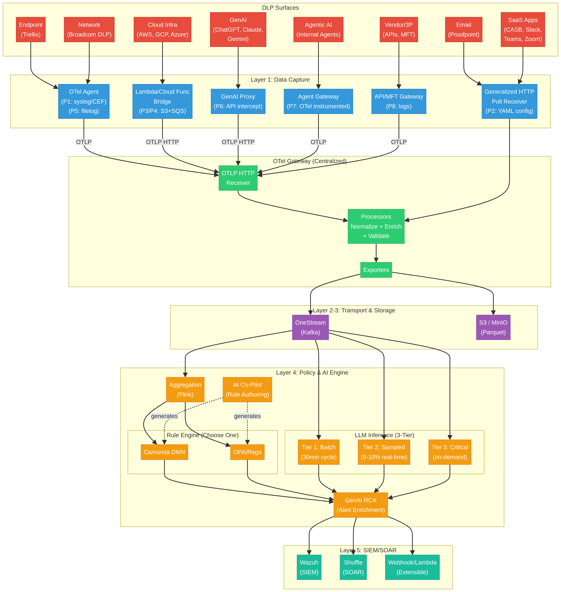

The earlier iterations of this architecture evolved through several design phases. The foundational unified architecture and the initial one-pager are shown below for reference:

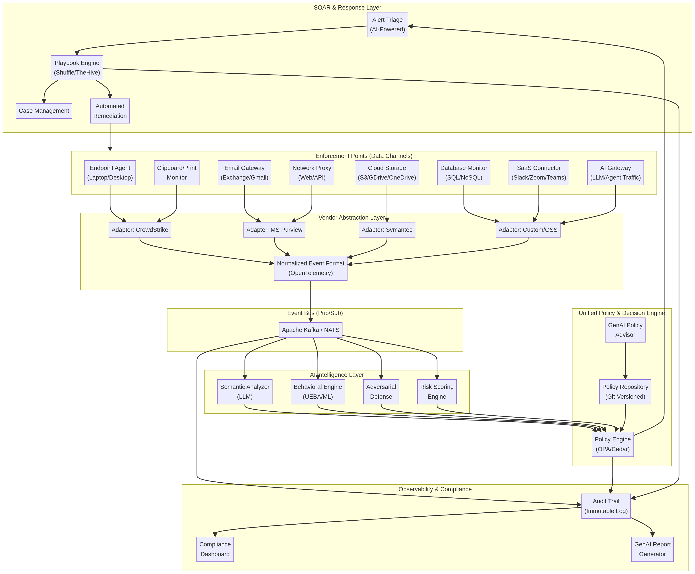

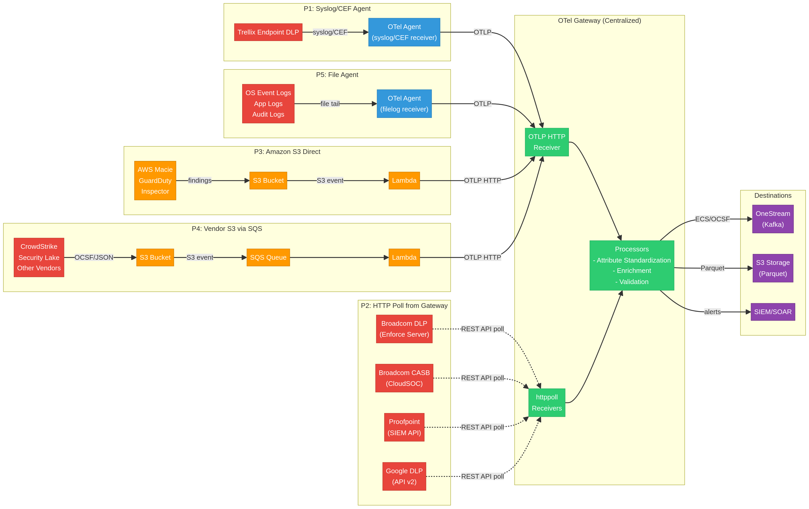

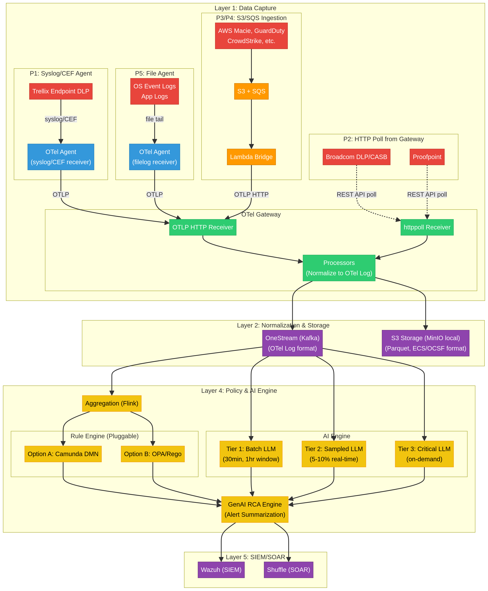

---

## 4. DLP Capability Groups

DLP agent capabilities can be categorized into eight distinct groups, each addressing a specific aspect of the data protection lifecycle. Understanding these groups is fundamental to appreciating their role in a broader security strategy and how they integrate with SOAR platforms.

| # | Capability Group | Description | Key Capabilities |
|---|---|---|---|
| 1 | **Detection & Identification** | Discovering and classifying sensitive data | Content Inspection (Regex), Exact Data Matching, Document Fingerprinting, OCR, ML Classifiers, Named Entity Recognition, Sensitivity Labels |
| 2 | **Monitoring & Visibility** | Continuous observation of data movement and user behavior | Real-time Activity Monitoring, Network Traffic Analysis, Cloud Activity Monitoring, User Behavior Analytics (UEBA), Shadow IT Detection |
| 3 | **Analysis & Intelligence** | Contextual analysis and threat intelligence | Contextual Analysis, Incident Correlation, Risk Scoring, Threat Intelligence Integration, Behavioral Baselining |
| 4 | **Prevention & Enforcement** | Blocking or modifying data movement to prevent loss | Endpoint Controls (USB, Print, Clipboard), Email Gateway Enforcement, Web/Cloud Upload Blocking, Encryption Enforcement, Quarantine |
| 5 | **Response & Remediation** | Automated and manual actions after detection | Automated Incident Response, User Notification, Quarantine & Rollback, Escalation Workflows, Evidence Collection |
| 6 | **Compliance & Reporting** | Regulatory compliance and audit support | Pre-built Compliance Templates (GDPR, HIPAA, PCI-DSS), Audit Trail Generation, Executive Dashboards, Evidence Packages |
| 7 | **Integration & Orchestration** | Connecting DLP with the broader security ecosystem | SIEM Integration, SOAR Playbook Triggers, Threat Intel Feed Consumption, Identity Provider Integration, Ticketing System Integration |
| 8 | **Policy Management** | Lifecycle management of DLP policies | Policy Authoring, Version Control, Testing/Simulation, Deployment, Audit Logging |

### SOAR Integration by Capability Group

Each capability group provides specific data and triggers that a SOAR platform can leverage:

| Capability Group | What It Provides to SOAR | SOAR Action |
|---|---|---|
| Detection & Identification | Alert with data type, match count, confidence | Triage, classify, route to appropriate playbook |
| Monitoring & Visibility | Behavioral anomaly signals, activity patterns | Enrich alerts with user context, trigger hunting |
| Analysis & Intelligence | Risk scores, correlated incidents, threat intel matches | Prioritize, auto-escalate high-risk incidents |
| Prevention & Enforcement | Block/allow decisions, enforcement outcomes | Verify enforcement, escalate failures, notify users |
| Response & Remediation | Incident status, remediation outcomes | Orchestrate multi-step response, track SLAs |
| Compliance & Reporting | Compliance status, audit data | Generate reports, prepare evidence packages |
| Integration & Orchestration | Cross-tool event data | Correlate across tools, unified investigation |
| Policy Management | Policy change events, coverage gaps | Auto-validate policy changes, gap alerting |

---

## 5. Detection & Identification Deep Dive

The foundation of any effective DLP strategy lies in its ability to accurately detect and identify sensitive information. This section provides a detailed breakdown of each detection capability.

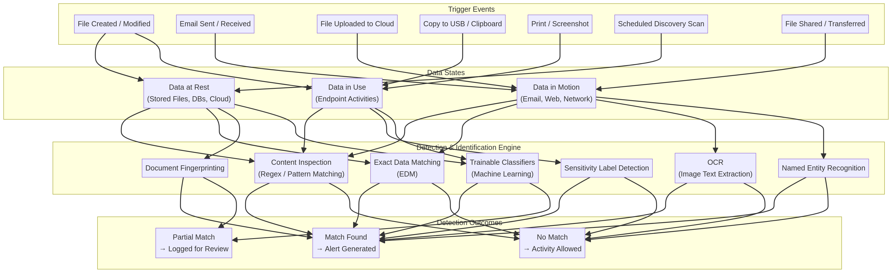

### 5.1. Content Inspection (Regular Expressions)

**How it Works:** Content Inspection using regular expressions (regex) is the most fundamental and widely deployed detection technique. It operates by scanning data streams — whether in files, emails, web traffic, or clipboard content — against a library of predefined patterns. Each pattern is a regex designed to match the structure of a specific type of sensitive data.

**When it is Used:** This capability is triggered at virtually every data checkpoint. It activates during **Data-in-Motion** events (email send, web upload, cloud sync), **Data-at-Rest** scans (scheduled repository scans), and **Data-in-Use** events (copy/paste, print, screen capture). It is the first line of defense and runs on every event.

**Real-World Scenario:** An employee drafts an email to an external partner and pastes a spreadsheet column containing customer credit card numbers. The email DLP gateway (Proofpoint) intercepts the outbound email and runs its regex library against the body and attachments. The Luhn-validated credit card regex fires, identifying 15 matches. The email is blocked, and an alert is generated.

**GenAI/AI Enhancement:** LLMs can provide semantic context that regex lacks. For example, regex detects "123-45-6789" as an SSN pattern, but an LLM can determine from surrounding text whether it's an actual SSN, a product serial number, or a test value — dramatically reducing false positives.

### 5.2. Exact Data Matching (EDM)

**How it Works:** EDM creates one-way cryptographic hashes (fingerprints) of specific, known sensitive data records from structured sources like databases. When data is scanned, the DLP agent hashes the content and compares it against the pre-computed hash database. A match confirms the presence of actual protected data, not just a pattern.

**When it is Used:** EDM is triggered during the same data checkpoints as regex but is specifically used when the organization needs to protect known, enumerated data — customer records, employee databases, patient lists. It is most valuable for **Data-in-Motion** and **Data-in-Use** scenarios.

**Real-World Scenario:** A hospital maintains a patient database with 50,000 records. EDM fingerprints are generated for all patient names, medical record numbers, and SSNs. When a departing employee attempts to upload a spreadsheet containing 200 patient records to a personal Google Drive, the cloud DLP (Broadcom CASB) matches the hashed content against the EDM database and blocks the upload.

### 5.3. Document Fingerprinting

**How it Works:** Document fingerprinting creates a unique signature of an entire document's structure and content, rather than individual data fields. It identifies documents that are identical or substantially similar to protected templates — contracts, financial reports, engineering designs, board presentations.

**When it is Used:** This capability is triggered when documents are shared, uploaded, or transferred. It is particularly effective for protecting standardized forms and templates that contain sensitive information.

### 5.4. Optical Character Recognition (OCR)

**How it Works:** OCR extracts text from images, screenshots, scanned documents, and photos, then feeds the extracted text into the content inspection pipeline (regex, EDM, etc.).

**When it is Used:** OCR is triggered when image files are detected at any data checkpoint. This is critical because a common DLP bypass technique is to screenshot sensitive data and share the image instead of the text.

**GenAI/AI Enhancement:** Modern multimodal LLMs can understand images directly without OCR, detecting sensitive content in charts, diagrams, handwritten notes, and complex layouts that traditional OCR misses.

### 5.5. Trainable Classifiers (Machine Learning)

**How it Works:** ML classifiers are trained on labeled datasets of sensitive and non-sensitive documents to learn patterns that distinguish them. Unlike regex, they understand document structure, language patterns, and context.

**When it is Used:** ML classifiers are used for unstructured data that doesn't follow predictable patterns — legal documents, intellectual property, strategic plans, research papers.

### 5.6. Named Entity Recognition (NER)

**How it Works:** NER uses natural language processing to identify and classify named entities in free-form text — person names, organization names, locations, dates, medical conditions, financial figures.

**When it is Used:** NER is triggered on unstructured text content where regex patterns are insufficient — emails, chat messages, documents, GenAI prompts.

### 5.7. Sensitivity Label Detection

**How it Works:** Sensitivity labels are metadata tags applied to documents and emails by users or automated classification tools (e.g., Microsoft Purview labels). The DLP agent reads these labels and enforces policies based on the classification level.

**When it is Used:** This capability is triggered whenever a labeled document is accessed, shared, or transferred. It is the fastest detection method because it reads metadata rather than scanning content.

---

## 6. Layer 1: Data Capture — Extensible Surfaces

This layer is responsible for ingesting DLP events from all surfaces using a catalog of standardized integration patterns. The core principle is to abstract the source-specific complexity away from the core pipeline, making extensibility a configuration change rather than a code change.

### 6.1. Integration Pattern Catalog

| Pattern | Name | Surfaces | Mechanism |
|---|---|---|---|
| **P1** | Syslog/CEF Agent | Endpoint (Trellix), Network (Broadcom DLP), Printers/USB | OTel Agent on compute node → syslog/CEF receiver → Gateway |
| **P2** | Generalized HTTP Poll | Broadcom CASB, Proofpoint, Google DLP, Slack, Teams, Zoom, Salesforce, GitHub, Snowflake, Databases | Single configurable receiver on Gateway with YAML config per vendor |
| **P3** | AWS S3 Direct | Macie, GuardDuty, Inspector, Security Hub, CloudTrail, Bedrock Guardrails | S3 → Lambda → OTLP HTTP → Gateway |
| **P3g** | GCP Equivalent | Security Command Center, GCP DLP, Cloud Audit Logs | GCS → Cloud Function → OTLP HTTP → Gateway |
| **P3a** | Azure Equivalent | Purview DLP, Defender for Cloud, Azure Monitor | Blob → Azure Function → OTLP HTTP → Gateway |
| **P4** | Vendor S3 via SQS | CrowdStrike, any vendor with S3 export | S3 → SQS → Lambda → OTLP HTTP → Gateway |
| **P5** | File Agent | OS event logs, application logs, audit logs | OTel Agent filelog receiver → Gateway |
| **P6** | GenAI Proxy | External LLMs (ChatGPT, Claude, Gemini) | API Proxy intercepts all LLM calls → emits events → Gateway |
| **P7** | Agentic AI Gateway | Internal AI agents (LangChain, CrewAI, custom) | OTel instrumentation in agent framework → captures tool calls, data access, LLM context → Gateway |
| **P8** | Vendor/Third-Party | Partner APIs, file exchanges (SFTP/MFT), vendor portals | API Gateway logs / MFT logs → P1, P2, or P5 depending on source |

### 6.2. OTel Two-Tier Deployment Model

The data capture layer uses a two-tier OpenTelemetry deployment:

**OTel Agents (Edge):** Deployed one per compute node (laptop, EC2, server). Each agent has multiple receivers applicable to that node. For example, a laptop running Trellix has a syslog receiver for Trellix CEF events and a filelog receiver for OS audit logs. Agents forward all data to the Gateway via OTLP.

**OTel Gateway (Centralized):** Receives data from all edge agents via OTLP. Also runs centralized receivers for SaaS polling (P2) and receives OTLP HTTP from Lambda bridges (P3, P4). The Gateway handles attribute standardization, enrichment, validation, and exports to OneStream, S3, and SIEM.

### 6.3. Generalized HTTP Poll Connector (P2)

To avoid building a new adapter for every SaaS API, a single, configurable OTel receiver handles all HTTP poll-based integrations. Adding a new SaaS vendor is a configuration change, not a code change.

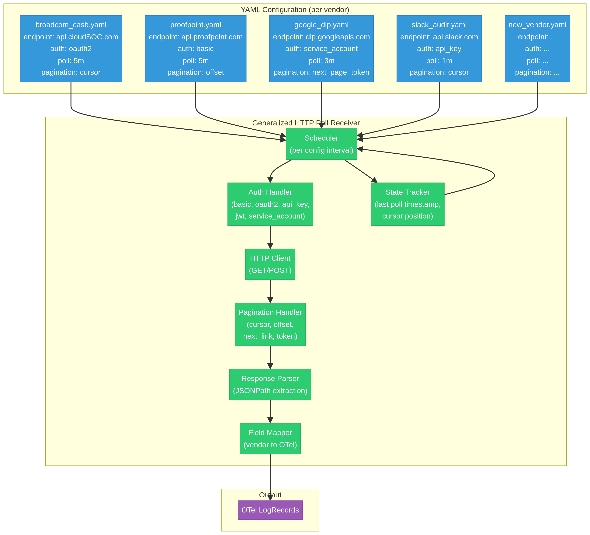

The connector is configured via YAML, with each vendor defined as a separate pipeline entry:

| Configuration Parameter | Description | Example |
|---|---|---|
| `endpoint_url` | Vendor API endpoint | `https://enforce.symantec.com/api/v2/incidents` |
| `auth_type` | Authentication method | `basic`, `oauth2`, `api_key`, `jwt` |
| `auth_credentials` | Credential reference | Environment variable reference |
| `poll_interval` | Frequency of polling | `5m`, `1m`, `30s` |
| `http_method` | HTTP method | `GET`, `POST` |
| `request_headers` | Custom headers | Content-Type, Accept |
| `request_body_template` | JSON body for POST-based APIs | Templated JSON |
| `pagination_strategy` | How to handle multi-page results | `offset`, `cursor`, `next_link`, `token` |
| `response_root_path` | JSONPath to the array of events | `$.data.incidents` |
| `field_mappings` | Vendor field → OTel attribute mapping | `incident_id → security.dlp.rule.id` |
| `timestamp_field` | Field and format for event timestamp | `$.created_at`, ISO8601 |
| `state_tracking` | How to track last-polled position | `timestamp`, `cursor`, `offset` |

The following sequence diagram illustrates the polling flow:

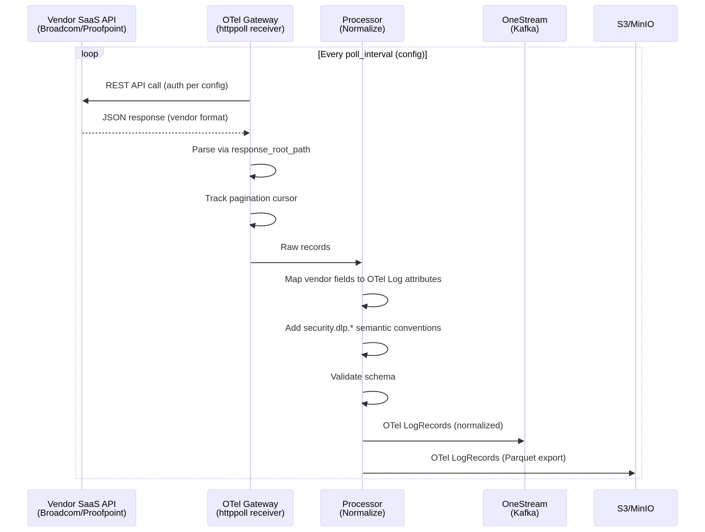

### 6.4. S3 Lambda Bridge (P3 & P4)

For vendors and cloud services that drop data into S3, a serverless Lambda function acts as a lightweight bridge. The flow is SQS-triggered, S3-backed:

1. Vendor writes file to S3
2. S3 event notification sends message to SQS (containing exact bucket + key)
3. Lambda is triggered by SQS message
4. Lambda fetches the specific file from S3
5. Lambda parses the file and streams records as OTLP HTTP to the Gateway

This decouples the S3-fetch complexity from the Gateway entirely.

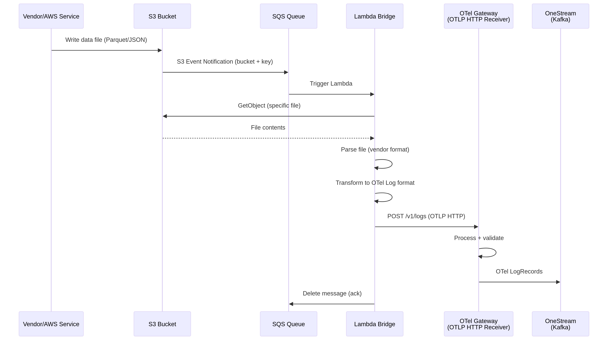

**Multi-Cloud Equivalents:**

| AWS | GCP | Azure |
|---|---|---|
| S3 | GCS | Blob Storage |
| SQS | Pub/Sub | Event Hub / Service Bus |
| Lambda | Cloud Functions | Azure Functions |

### 6.5. GenAI Proxy (P6)

All external LLM calls are routed through a proxy that inspects prompts for sensitive data, applies company guardrails, and emits detailed OTel logs for every interaction. This is a 3-layer defense:

1. **API Gateway/Proxy** — intercepts all LLM API calls, inspects prompts and responses
2. **AWS Bedrock Guardrails** — for internal LLM usage via Bedrock
3. **Company-Specific Guardrails** — independent system with logs of all blocked/censored data available for DLP analysis

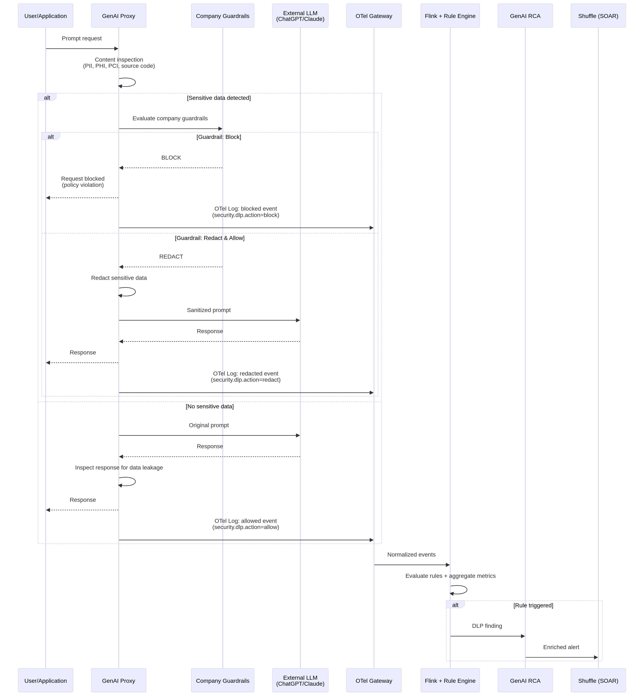

### 6.6. Agentic AI Gateway (P7)

Internal AI agents are instrumented with OpenTelemetry. All agent tool calls go through an internal gateway that captures **who** triggered the agent, **what** data was accessed and shared, and **when** it happened. The gateway and agents are instrumented with OTel, providing deep visibility into autonomous agent behavior.

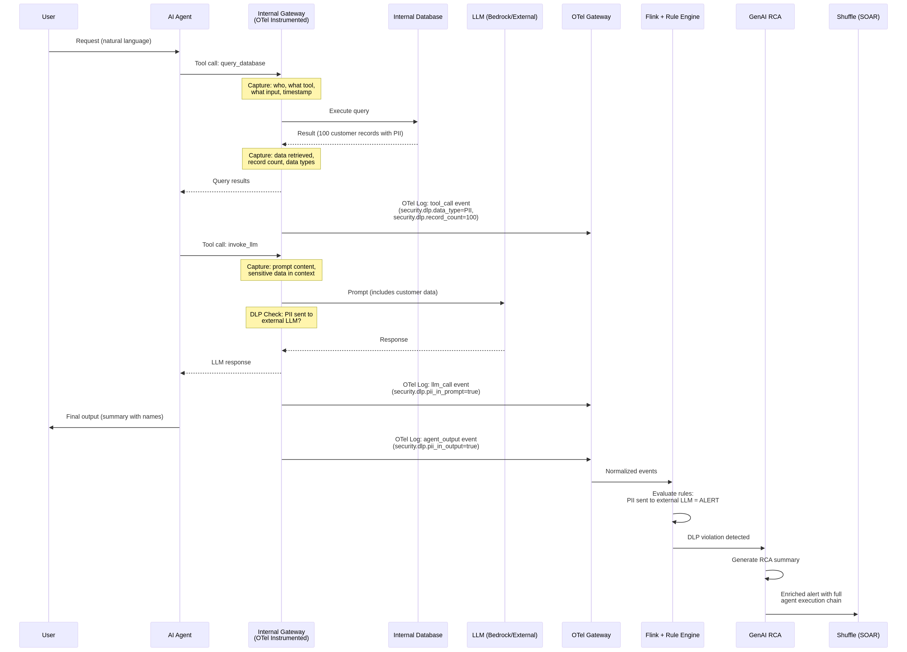

### 6.7. Extensibility Design Principle

Extensibility is critical at every layer. The architecture supports adding new surfaces through:

- **New P2 vendors:** Add a YAML configuration block to the generalized HTTP poll connector
- **New cloud providers:** Deploy the equivalent serverless function (Lambda/Cloud Function/Azure Function) using the same pattern
- **New SaaS apps:** If the SaaS provides an API → P2; if it provides S3 export → P4; if it provides webhooks → P2 with HTTP receiver
- **New downstream targets:** Add a new OTel exporter to the Gateway

---

## 7. Layer 2: Normalization — OTel & OCSF

All data, regardless of source, is normalized into the **OTel Log Data Model** as the canonical internal format. This provides a single normalization point — each adapter normalizes vendor-specific format to OTel Logs once. At the export stage, OTel exporters can project to ECS (for Elastic/Wazuh), OCSF (for S3 storage and interoperability), or any other format.

### 7.1. DLP Semantic Conventions for OTel

The standard OTel model is extended with DLP-specific semantic conventions:

| Attribute | Type | Description | Example |
|---|---|---|---|
| `security.dlp.action` | string | The action taken by the DLP system | `allow`, `block`, `redact`, `alert` |
| `security.dlp.severity` | string | The severity of the DLP event | `critical`, `high`, `medium`, `low` |
| `security.dlp.policy.name` | string | The name of the policy that triggered | `PII in External LLM Prompt` |
| `security.dlp.rule.id` | string | The specific ID of the rule that matched | `RULE-12345` |
| `security.dlp.data_type` | string[] | The types of sensitive data detected | `["pii.credit_card", "pii.ssn"]` |
| `security.dlp.match_count` | int | The number of sensitive data matches found | `5` |
| `security.dlp.source.channel` | string | The channel where the event originated | `email`, `endpoint`, `saas`, `genai`, `agentic_ai` |
| `security.dlp.source.vendor` | string | The vendor that generated the event | `trellix`, `broadcom_dlp`, `proofpoint` |
| `security.dlp.data_lifecycle_state` | string | State of data when detected | `at_rest`, `in_transit`, `in_use` |
| `security.dlp.agent.execution_id` | string | For Agentic AI, the unique execution chain ID | `run-abc-123` |
| `security.dlp.agent.tool_name` | string | For Agentic AI, the tool that was called | `sql_query`, `file_read` |
| `user.name` | string | The user who triggered the event | `john.doe@company.com` |
| `file.path` | string | The file involved in the event | `/data/customers.csv` |
| `host.name` | string | The host where the event occurred | `laptop-jdoe-01` |

### 7.2. Export Projections

| Destination | Schema | Exporter |
|---|---|---|
| Wazuh (SIEM) | ECS (Elastic Common Schema) | OTel → ECS exporter |
| S3 Long-term Storage | OCSF (Open Cybersecurity Schema Framework) | OTel → OCSF exporter |
| OneStream (Kafka) | OTel Log (canonical) | OTLP Kafka exporter |
| External Consumers | OCSF or ECS | Configurable per consumer |

---

## 8. Layer 3: Transport & Storage

### 8.1. OneStream (Kafka)

OneStream is the Kafka-based event bus with an HTTP interface that serves as the central nervous system of the platform. It provides high-throughput, durable, ordered event streaming with built-in data validation.

**Key Topics:**

| Topic | Content | Consumers |
|---|---|---|
| `dlp.events.raw` | All normalized DLP events from Gateway | Flink (aggregation), SIEM, S3 archiver |
| `dlp.events.enriched` | Events enriched with aggregated metrics | Policy Engine |
| `dlp.alerts` | Alerts generated by Policy Engine + AI | SOAR (Shuffle), SIEM (Wazuh) |
| `dlp.feedback` | Analyst dispositions, false positive labels | LLM fine-tuning pipeline, rule tuning |

### 8.2. S3 / MinIO Storage

Long-term, cost-effective storage for all normalized DLP events:

| Aspect | Specification |
|---|---|
| **Format** | Apache Parquet (columnar, compressed) |
| **Partitioning** | `source/date/severity` (e.g., `s3://dlp-data/trellix/2026-02-13/high/`) |
| **Tiering** | Hot (S3 Standard, 0-30 days) → Warm (S3 IA, 30-90 days) → Cold (Glacier, 90+ days) |
| **Query Engine** | Athena (production) / DuckDB (local development) |
| **Local Equivalent** | MinIO (S3-compatible, runs in Docker) |

---

## 9. Layer 4: Policy & AI Engine

This is the brain of the system, where detection logic is executed and AI provides contextual enrichment. The layer has four components: Aggregation, Rule Engine, AI Inference, and GenAI RCA.

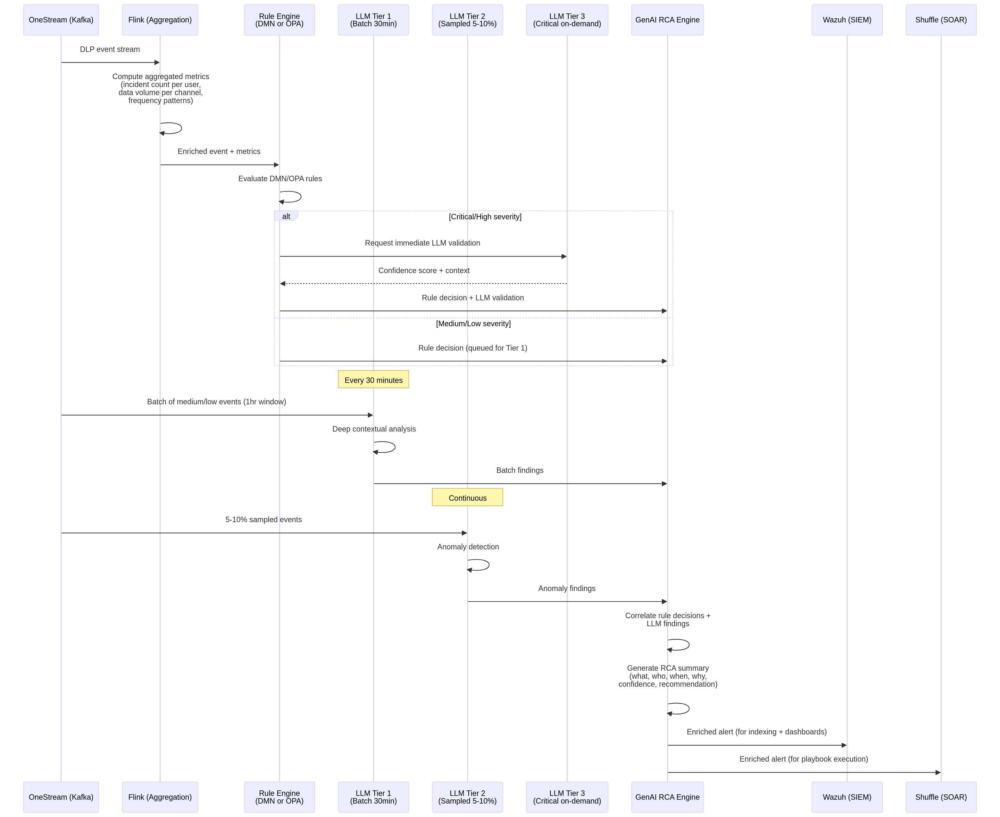

### 9.1. Aggregation (Apache Flink)

Apache Flink consumes the raw event stream from OneStream to compute stateful, time-windowed metrics. These metrics are fed into the rule engine to enable sophisticated, context-aware rules.

| Metric | Window | Example Use |
|---|---|---|
| Incident count per user | 1hr, 24hr, 7d | "If user has >5 incidents in 7 days → escalate" |
| Data volume per channel | 1hr | "If >100MB transferred via cloud in 1hr → alert" |
| Unique data types per user | 24hr | "If user triggers PII + PCI + IP in same day → critical" |
| Cross-channel event count | 1hr | "If same user triggers events on 3+ channels in 1hr → escalate" |
| Agent data access volume | Per execution | "If agent retrieves >50 PII records → alert" |

### 9.2. Pluggable Rule Engine

The architecture supports two alternate, pluggable rule engines. The choice depends on the organization's preference. Only one will be chosen, but both are designed for the same slot in the architecture.

#### Option A: Camunda DMN

| Aspect | Detail |
|---|---|
| **Engine** | Camunda DMN Engine (open-source, Apache 2.0) |
| **Authoring** | Visual decision tables in Camunda Modeler |
| **Language** | FEEL (Friendly Enough Expression Language) — supports regex via `matches()`, nested logic via sub-decisions |
| **Complexity** | Supports nested 4-5 level rules via chained decision tables |
| **Deployment** | Embedded Java microservice or standalone |
| **Best For** | Security analysts who prefer visual authoring |

#### Option B: OPA/Rego

| Aspect | Detail |
|---|---|
| **Engine** | Open Policy Agent (CNCF graduated, open-source) |
| **Authoring** | Rego language (manual or AI-generated) |
| **Language** | Rego — Datalog-inspired, supports `regex.match()`, complex logic |
| **Complexity** | Supports arbitrary programmatic logic |
| **Deployment** | OPA binary, sidecar, or server |
| **Best For** | Security engineers, policy-as-code workflows |

**Common Interface (Both Options):**

| Aspect | Specification |
|---|---|
| **Input** | Enriched event JSON (OTel Log + Flink aggregated metrics) |
| **Output** | Decision JSON: `{action, severity, rule_id, confidence, metadata}` |
| **Rule Storage** | Git-backed repository (DMN XML files or Rego files) |
| **Rule Deployment** | CI/CD pipeline pushes to engine (hot-reload) |
| **Rule Lifecycle** | Author → Test (against historical data) → Shadow Mode → Activate → Monitor → Tune |

### 9.3. AI Role 1: Rule Co-Pilot (Design-Time)

A GenAI-powered assistant helps policy authors create, test, and optimize rules. This is NOT in the real-time data path — it's a tooling layer that sits alongside the DMN/Rego editor.

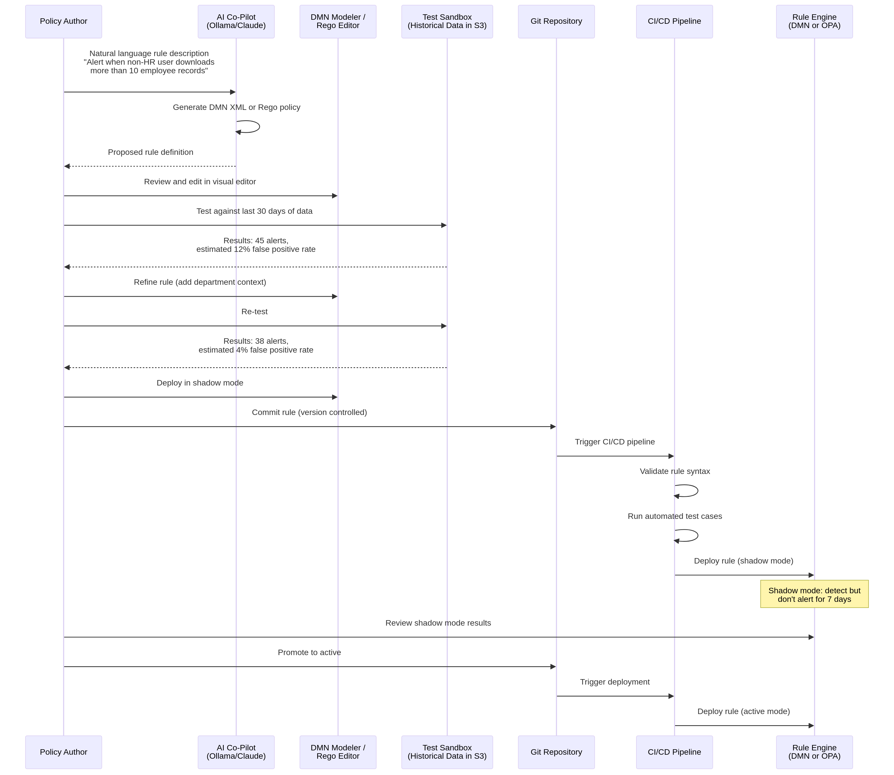

| Step | What AI Does |
|---|---|
| **Create** | Analyst describes intent in natural language → GenAI generates DMN decision table XML or Rego policy |
| **Test** | GenAI generates synthetic test data to validate the rule against edge cases |
| **Optimize** | GenAI reviews existing rules, identifies overlaps, gaps, or contradictions |
| **Document** | GenAI auto-generates rule documentation and change summaries |

### 9.4. AI Role 2: LLM Inference (Run-Time)

A 3-tier LLM inference model runs in parallel to the rule engine to detect anomalies and provide contextual validation. This is a separate, parallel flow — not sequential with the rule engine.

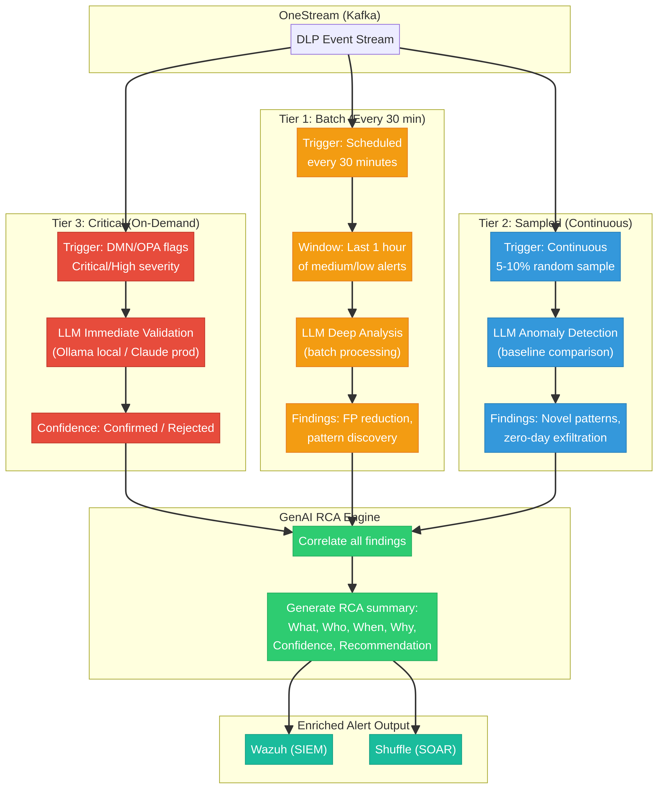

| Tier | Trigger | Frequency | Scope | Purpose |
|---|---|---|---|---|
| **Tier 1: Batch** | Scheduled (every 30 min) | Processes last 1 hour of data | All events that DMN/OPA flagged as medium/low confidence | Deep contextual analysis — reduces false positives |
| **Tier 2: Sampled** | Continuous | 5-10% of all events | Random sample across all event types | Baseline learning — catches novel patterns no rule covers |
| **Tier 3: Critical** | DMN/OPA flags Critical/High | Immediate | Only critical/high severity alerts | Real-time LLM validation before alert reaches SOC |

**LLM Model Strategy:**

| Environment | Model | Purpose |
|---|---|---|
| Local Development | Ollama (Llama 3, Mistral, Qwen) | Testing, prototyping, offline development |
| Production | AWS Bedrock (Claude) | Production inference, RCA generation |
| Future | Fine-tuned model on DLP data | Improved accuracy, domain-specific understanding |

### 9.5. GenAI RCA Engine

The final enrichment step correlates findings from the rule engine and the LLM inference tiers to produce a single, enriched alert. For every alert — regardless of whether it came from DMN/OPA rules, LLM inference, or both — the GenAI RCA Engine generates a root cause analysis summary:

| RCA Component | Content |
|---|---|
| **What happened** | Plain-language description of the event |
| **Who was involved** | User, device, agent, application |
| **What data was at risk** | Data types, classification, volume |
| **Why it's a risk** | Policy violated, regulatory implication, behavioral anomaly |
| **Confidence score** | Combined confidence from rules + LLM |
| **Recommended action** | Suggested next step for the analyst |
| **Related events** | Cross-channel correlated events for the same user/entity |

---

## 10. Layer 5: SIEM/SOAR & Extensible Output

### 10.1. SIEM — Wazuh

Enriched alerts are sent to Wazuh (open-source SIEM + XDR) for indexing, search, and dashboarding. Wazuh uses the Elastic stack backend and supports ECS natively.

### 10.2. SOAR — Shuffle

Enriched alerts are sent to Shuffle (open-source SOAR) to trigger automated response playbooks. Alert delivery uses webhooks (local development) or Lambda-based integration (production).

### 10.3. Extensible Output

The output layer is designed to be pluggable. New targets can be added as new exporters from the OTel Gateway or as new consumers from OneStream:

| Output Target | Mechanism | Use Case |
|---|---|---|
| Wazuh (SIEM) | OTel ECS exporter | Detection, search, dashboards |
| Shuffle (SOAR) | Webhook / Lambda | Automated response playbooks |
| S3 (Archive) | OTel S3 exporter | Long-term storage, compliance |
| Ticketing (Jira/ServiceNow) | SOAR integration | Incident tracking |
| Email/Slack Notification | SOAR integration | Analyst notification |
| Custom Webhook | HTTP exporter | Any downstream system |

### 10.4. Feedback Loop

Analyst actions in the SOAR (marked as false positive, escalated, resolved) are published back to OneStream's `dlp.feedback` topic. This data feeds into:
- Rule tuning (identify rules with high false positive rates)
- LLM fine-tuning pipeline (improve AI accuracy over time)

---

## 11. Vendor-Specific Integration & Data Points

### 11.1. Current Vendor Stack

| Vendor | Domain | Integration Pattern | Key Data Points |
|---|---|---|---|
| **Broadcom Symantec DLP** | Network data in motion | P2 (HTTP Poll) | `incidentId`, `policyName`, `severity`, `matchCount`, `detectionDate`, `senderIP`, `recipientURL`, `messageSubject`, `fileNames`, `violatedPolicyRules` |
| **Broadcom CloudSOC CASB** | Data at rest in SaaS | P2 (HTTP Poll) | `alertId`, `cloudService`, `userName`, `activity`, `objectName`, `objectType`, `riskLevel`, `dataExposure`, `sharingScope`, `dlpPolicyMatch` |
| **Trellix Endpoint DLP** | Endpoint DLP | P1 (Syslog/CEF Agent) | `deviceAction`, `sourceUserName`, `sourceHostName`, `fileName`, `filePath`, `deviceCustomString` (policy name), `severity`, `destinationType` (USB, print, clipboard, network) |
| **Proofpoint** | Email DLP & information protection | P2 (HTTP Poll) | `messageID`, `sender`, `recipients`, `subject`, `threatsInfoMap`, `policyRoutes`, `classification`, `spamScore`, `phishScore`, `malwareScore`, `attachments` |
| **Google Cloud DLP** | Native Google workspace DLP | P2 (HTTP Poll) | `infoType.name`, `likelihood`, `location.byteRange`, `location.codepointRange`, `contentLocations`, `quote` (matched text snippet), `createTime` |

### 11.2. Vendor Integration Assessment Matrix

Before building any custom receiver, the first question for each vendor should be: **"Can this vendor write to S3? If yes, in what format?"**

| Vendor | S3 Export? | Webhook? | Standard Format? | Fallback API | Best Pattern |
|---|---|---|---|---|---|
| Broadcom DLP | No | No | CEF (via syslog) | REST API (Enforce Server) | P2 |
| Broadcom CASB | No | Limited | Proprietary JSON | REST API | P2 |
| Trellix | No | No | CEF (syslog) | ePO REST API | P1 |
| Proofpoint | No | No | Proprietary JSON | SIEM API (REST) | P2 |
| Google DLP | Via Pub/Sub | Via Pub/Sub | Proprietary JSON | REST API | P2 |
| CrowdStrike | Yes (Security Lake) | Yes | OCSF | REST API (Falcon) | P4 |
| AWS Macie | Yes (S3) | Via EventBridge | OCSF (via Security Lake) | REST API | P3 |

---

## 12. AWS Security Services Inventory

AWS provides a deep bench of security services that can feed DLP-relevant data into the unified platform. These are organized into three tiers.

### Tier 1: Core DLP Services

| Service | DLP Role | Key Data Points | Integration Pattern |
|---|---|---|---|
| **AWS Macie** | S3 content scanning, PII/PHI/PCI detection | `findingType`, `severity.score`, `classificationDetails.result.sensitiveData`, `resourcesAffected.s3Bucket`, `resourcesAffected.s3Object`, `count` | P3 |
| **Amazon GuardDuty** | Behavioral threat detection, S3 exfiltration anomalies | `type` (e.g., `Exfiltration:S3/AnomalousBehavior`), `severity`, `resource`, `service.action`, `service.evidence` | P3 |
| **AWS Security Hub** | Findings aggregation across services | `ProductArn`, `Types`, `Severity`, `Resources`, `Compliance.Status`, `Remediation` | P3 |

### Tier 2: Foundational Data Sources

| Service | DLP Role | Key Data Points | Integration Pattern |
|---|---|---|---|
| **AWS CloudTrail** | API audit trail — who accessed what, when | `eventName`, `userIdentity`, `sourceIPAddress`, `requestParameters`, `responseElements`, `resources` | P3 |
| **IAM Access Analyzer** | Identifies resources exposed to external entities | `analyzedResource`, `isPublic`, `sharedVia`, `principal`, `condition` | P3 |
| **AWS Config** | Configuration posture — detects misconfigurations | `resourceType`, `complianceType`, `configRuleName`, `annotation` | P3 |
| **VPC Flow Logs** | Network metadata — detects unusual data transfer volumes | `srcaddr`, `dstaddr`, `bytes`, `packets`, `protocol`, `action`, `flowDirection` | P3 |

### Tier 3: Advanced / Channel-Specific

| Service | DLP Role | Key Data Points | Integration Pattern |
|---|---|---|---|
| **Amazon Bedrock Guardrails** | Prevents sensitive data leakage through GenAI/LLM | `guardrailId`, `action` (BLOCKED/ANONYMIZED), `assessments.sensitiveInformationPolicy`, `inputTokenCount`, `outputTokenCount` | P3 |
| **SNS Message Data Protection** | Real-time PII/PHI detection in messaging pipelines | `messageId`, `dataIdentifier`, `operation` (AUDIT/DE_IDENTIFY/DENY), `findingsDestination` | P3 |
| **CloudWatch Logs Data Protection** | Detects and masks sensitive data in application logs | `logGroupName`, `dataIdentifier`, `operation`, `findings` | P3 |
| **AWS Network Firewall** | TLS inspection, network-level exfiltration prevention | `firewall.rule_group`, `event.alert.signature`, `src_ip`, `dest_ip`, `proto`, `bytes` | P3 |
| **AWS WAF** | HTTP-level inspection, blocks sensitive data in web requests | `ruleId`, `action`, `httpRequest`, `rateBasedRuleList`, `terminatingRuleMatchDetails` | P3 |
| **AWS KMS** | Encryption governance — tracks encrypt/decrypt operations | `eventName` (Decrypt, GenerateDataKey), `userIdentity`, `resources.ARN`, `requestParameters.keyId` | P3 |
| **AWS Glue DataBrew** | PII detection and masking in data pipelines | `recipeAction`, `detectedEntities`, `columnStatistics`, `dataProfile` | P3 |

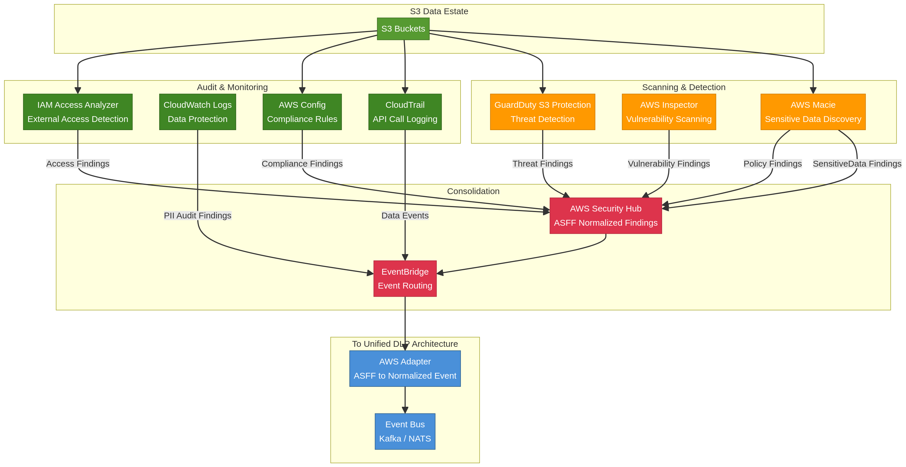

---

## 13. OCSF Schema Integration

The **Open Cybersecurity Schema Framework (OCSF)** plays a foundational role in this architecture, particularly for S3 storage and cross-vendor interoperability.

### 13.1. Why OCSF Matters

OCSF v1.2 introduced the **`Data Security Finding` [2006]** event class, specifically built for DLP, Data Classification, and DSPM tools. It is the industry-standard schema for DLP events.

### 13.2. OCSF Data Security Finding [2006] — Key Fields

| OCSF Field | Description | Maps From |
|---|---|---|
| `data_security.data_lifecycle_state_id` | State of data (at-rest, in-transit, in-use) | `security.dlp.data_lifecycle_state` |
| `data_security.detection_system_id` | Type of detection system | Vendor type |
| `data_security.data_classification` | Classification of detected data | `security.dlp.data_type` |
| `finding_info.title` | Finding title | `security.dlp.policy.name` |
| `finding_info.uid` | Unique finding ID | `security.dlp.rule.id` |
| `severity_id` | Severity level | `security.dlp.severity` |
| `status_id` | Finding status | `security.dlp.action` |
| `actor.user` | User who triggered the event | `user.name` |
| `device` | Device information | `host.name` |

### 13.3. Vendor-to-OCSF Detection System Mapping

| Your Tool | OCSF `detection_system_id` |
|---|---|
| Broadcom DLP | `2` (DLP Gateway) or `5` (Secure Web Gateway) |
| Broadcom CASB | `8` (Cloud Access Security Broker) |
| Trellix Endpoint | `1` (Endpoint) |
| Proofpoint Email | `6` (Secure Email Gateway) |
| Google DLP | `4` (Data Discovery & Classification) |
| AWS Macie | `4` (Data Discovery & Classification) or `11` (DSPM) |
| Bedrock Guardrails | `10` (Application-Level DLP) |

### 13.4. Architecture Role

OTel Log Data Model is the **canonical internal format** (used within the pipeline). OCSF is the **canonical storage and interoperability format** (used when writing to S3 and sharing with external consumers). The OTel Gateway's S3 exporter transforms OTel Logs → OCSF before writing to S3.

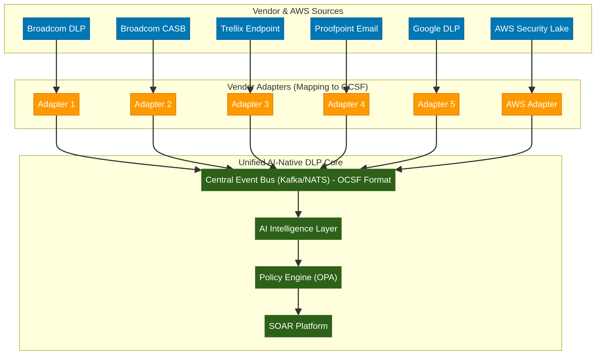

---

## 14. Adapter Solutioning

Each adapter follows one of the integration patterns (P1–P8) and is built as an OTel component — either a custom receiver on the Gateway or a Lambda bridge.

### 14.1. Adapter Summary

| # | Adapter | Pattern | Auth | Data Retrieval | Deployment |
|---|---|---|---|---|---|
| 1 | Broadcom Symantec DLP | P2 (HTTP Poll) | Basic Auth + JSESSIONID | REST API, polling every 5 min | OTel Gateway receiver |
| 2 | Broadcom CloudSOC CASB | P2 (HTTP Poll) | API Key + JWT Bearer | REST API, polling every 5 min | OTel Gateway receiver |
| 3 | Trellix Endpoint DLP | P1 (Syslog/CEF) | IP Whitelisting | Syslog stream (continuous) | OTel Agent on endpoint |
| 4 | Proofpoint Email DLP | P2 (HTTP Poll) | Basic Auth (Service Principal) | SIEM API, polling every 5 min | OTel Gateway receiver |
| 5 | Google Cloud DLP | P2 (HTTP Poll) | Service Account (ADC) | REST API or Pub/Sub | OTel Gateway receiver |
| 6 | AWS Services | P3 (S3 Direct) | IAM Role | S3 → SQS → Lambda → OTLP HTTP | Lambda bridge |

### 14.2. Common Adapter Framework

All adapters share common patterns:

| Aspect | Specification |
|---|---|
| **Stateless Design** | No local state; cursor/offset stored externally (Redis, DynamoDB) |
| **Configuration** | YAML-based, environment variable references for secrets |
| **Logging** | Structured JSON logs with correlation IDs |
| **Error Handling** | Exponential backoff with jitter, dead-letter queue for failed events |
| **Idempotency** | Event deduplication using vendor-provided event IDs |
| **Health Check** | Standard `/health` endpoint for monitoring |

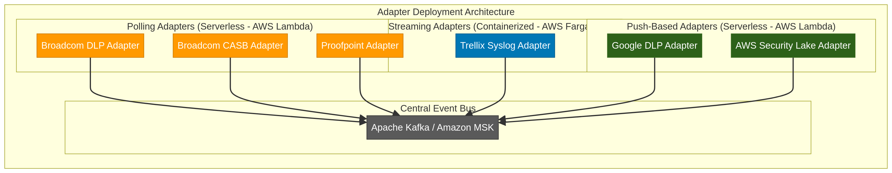

---

## 15. Agentic AI — DLP Surface Deep Dive

Agentic AI represents a fundamentally new DLP surface. Unlike traditional surfaces where a human initiates an action, an AI agent autonomously decides what data to access, how to process it, and where to send it. From a DLP perspective, the core question is:

> **"Is sensitive data leaving the organization, being exposed to unauthorized parties, or being mishandled — through or because of an AI agent?"**

### 15.1. Why Agentic AI is Different from Every Other DLP Surface

| Traditional DLP Surface | Agentic AI Surface |
|---|---|
| Human initiates action | Agent autonomously initiates action |
| Single action (send email, upload file) | Multi-step chain (query DB → process → call API → send to LLM → write output) |
| Predictable data flow | Dynamic, non-deterministic data flow |
| Static policies work | Policies need to understand intent and chain context |
| One channel at a time | Agent may touch multiple channels in one execution |
| User is accountable | Accountability is complex — developer, user, or agent? |
| Data volume is human-scale | Agent can access thousands of records in seconds |
| Exfiltration is intentional or accidental | Agent may "exfiltrate" data as part of its normal function |

### 15.2. DLP Concerns for Agentic AI

1. **Data going INTO an LLM** — Is the agent sending sensitive data to an external or internal model?
2. **Data coming OUT of an agent** — Is the agent's output exposing sensitive data to unauthorized users?
3. **Data moving BETWEEN systems via an agent** — Is the agent acting as a bridge that moves sensitive data from a protected system to an unprotected one?

### 15.3. Agentic AI User Stories (DLP Context Only)

#### A. Data-in-Motion Visibility

| ID | User Story |
|---|---|
| AG1.1 | As a Security Analyst, I want to see what sensitive data (PII, PHI, PCI, IP) was included in the context/prompt sent by an agent to any LLM, so I can detect data leakage to the model. |
| AG1.2 | As a Security Analyst, I want to see what sensitive data an agent retrieved from internal systems (databases, APIs, file stores) during its execution, so I can assess what was at risk of exposure. |
| AG1.3 | As a Security Analyst, I want to see what sensitive data was included in the agent's final output (to user, to API, to file, to another agent), so I can detect unauthorized data disclosure. |
| AG1.4 | As a Security Analyst, I want to detect when an agent moves sensitive data from a high-trust system to a low-trust destination (e.g., internal DB → external LLM). |
| AG1.5 | As a Security Analyst, I want to detect when the volume of sensitive data accessed by an agent in a single execution exceeds normal thresholds. |

#### B. DLP Policy for Agents

| ID | User Story |
|---|---|
| AG2.1 | As a Policy Author, I want to define what data types an agent is allowed to send to external LLMs vs. internal LLMs. |
| AG2.2 | As a Policy Author, I want to define output redaction rules — e.g., "Agent outputs must have SSNs, credit card numbers masked before delivery." |
| AG2.3 | As a Policy Author, I want to define volume limits on sensitive data retrieval — e.g., "No agent may retrieve more than 50 PII records in a single execution." |
| AG2.4 | As a Policy Author, I want to define cross-boundary rules — e.g., "If an agent retrieves Confidential data, it must not write to any external destination." |
| AG2.5 | As a Policy Author, I want to define rules for agent-to-agent data passing — same DLP policies must apply when Agent A passes PII to Agent B. |
| AG2.6 | As a Policy Author, I want to define guardrails for what data types can appear in LLM prompts constructed by agents — e.g., "No source code in external LLM prompts." |

#### C. Threat Detection

| ID | User Story |
|---|---|
| AG3.1 | As a Security Analyst, I want to detect when a prompt injection causes an agent to retrieve and expose sensitive data it was not intended to access. |
| AG3.2 | As a Security Analyst, I want to detect data harvesting — where an agent is repeatedly invoked to systematically extract sensitive data in small batches that individually pass thresholds but collectively represent large exfiltration. |
| AG3.3 | As a Security Analyst, I want to detect when a user uses an agent to access sensitive data they don't have direct access to — the agent bypasses RBAC using its own elevated permissions. |
| AG3.4 | As a Security Analyst, I want to detect when an agent's output contains sensitive data that was not in the user's original request — indicating autonomous data exposure. |
| AG3.5 | As a Security Analyst, I want the LLM inference layer to analyze agent data flows for patterns that rule-based detection would miss — e.g., sensitive data obfuscated or paraphrased by the agent. |

#### D. Investigation & Response

| ID | User Story |
|---|---|
| AG4.1 | As an L2 Analyst, I want to see the full data flow of an agent execution — what sensitive data went in, what moved between steps, and what came out — when investigating a DLP alert. |
| AG4.2 | As an L2 Analyst, I want to trigger a response action (block agent output, redact sensitive data, notify user) when a DLP violation is detected. |
| AG4.3 | As a Compliance Analyst, I want to audit all instances where agents accessed or transmitted regulated data (PII, PHI, PCI) for regulatory reporting. |

---

## 16. User Roles & User Stories

### 16.1. User Roles (Cyber-Specific)

| Role | Responsibility | Primary System Interaction |
|---|---|---|
| **Security Analyst (L1)** | First-line alert triage, initial investigation, false positive disposition | Alert queue, RCA summaries, Wazuh dashboards |
| **Security Analyst (L2/L3)** | Deep investigation, incident response, threat hunting, cross-channel correlation | Shuffle playbooks, raw event search, forensic data in S3 |
| **DLP Policy Author** | Creates, tests, tunes, and manages DLP detection rules and policies | DMN Modeler / Rego editor, AI Co-Pilot, rule testing sandbox |
| **SOC Manager** | Operational oversight, SLA tracking, analyst workload, escalation management | Operational dashboards, metrics, team performance |
| **Threat Intelligence Analyst** | Feeds external threat intel into DLP rules, identifies emerging exfiltration TTPs | Threat intel feeds, rule recommendations, TTP-to-rule mapping |
| **Compliance & Risk Analyst** | Regulatory compliance monitoring, audit preparation, risk scoring | Compliance reports, policy coverage matrix, audit trails |
| **CISO / Security Director** | Strategic risk posture, executive reporting, program effectiveness | Executive dashboards, posture trends, cost metrics |

### 16.2. Security Analyst (L1) — Alert Triage & Disposition

| ID | User Story |
|---|---|
| SA1.1 | As an L1 Analyst, I want to see a single, unified alert queue that aggregates DLP alerts from all channels so that I have one place to work, not 7 vendor consoles. |
| SA1.2 | As an L1 Analyst, I want each alert to display a GenAI-generated RCA summary that explains what happened, who was involved, what data was at risk, and a recommended action. |
| SA1.3 | As an L1 Analyst, I want to see the confidence score of each alert (from DMN/OPA rules and LLM inference) so I can prioritize high-confidence alerts first. |
| SA1.4 | As an L1 Analyst, I want to mark an alert as true positive, false positive, or needs escalation, and have that disposition recorded for audit and model feedback. |
| SA1.5 | As an L1 Analyst, I want to see if the same user has triggered alerts on other channels in the last 24/48/72 hours to identify multi-channel exfiltration patterns. |
| SA1.6 | As an L1 Analyst, I want alerts auto-grouped by user, incident, or campaign so related alerts are investigated together. |
| SA1.7 | As an L1 Analyst, I want to see the DLP policy that triggered the alert, including the specific rule, matched content snippet, and data classification label. |
| SA1.8 | As an L1 Analyst, I want to filter alerts by channel, severity, data type, and time range. |
| SA1.9 | As an L1 Analyst, I want to see the original raw event data (OTel Log) alongside the enriched alert to verify the detection. |
| SA1.10 | As an L1 Analyst, I want the system to auto-suppress known false positive patterns based on historical dispositions. |

### 16.3. Security Analyst (L2/L3) — Investigation & Response

| ID | User Story |
|---|---|
| SA2.1 | As an L2 Analyst, I want to search across all historical DLP events (in S3) for a specific user, file hash, data pattern, or IP address. |
| SA2.2 | As an L2 Analyst, I want to see a full timeline of a user's DLP-related activities across all channels, ordered chronologically. |
| SA2.3 | As an L2 Analyst, I want to trigger a Shuffle playbook directly from an alert to automate response actions. |
| SA2.4 | As an L2 Analyst, I want the SOAR playbook to call back to the original vendor to execute containment actions natively. |
| SA2.5 | As an L2 Analyst, I want to pivot from a DLP alert to related events in Wazuh for full context. |
| SA2.6 | As an L2 Analyst, I want to create threat hunting queries that run across all normalized DLP data. |
| SA2.7 | As an L2 Analyst, I want to see all data accessed by an AI agent when investigating an agentic AI-related DLP alert. |
| SA2.8 | As an L2 Analyst, I want to see all prompts and responses blocked by the GenAI proxy or company guardrails. |
| SA2.9 | As an L2 Analyst, I want to export an investigation report for handoff to legal, HR, or management. |
| SA2.10 | As an L2 Analyst, I want to request the LLM to generate a deeper analysis of a specific incident. |

### 16.4. DLP Policy Author — Rule Lifecycle

| ID | User Story |
|---|---|
| PA1.1 | As a Policy Author, I want to describe a DLP rule in natural language and have the AI Co-Pilot generate the DMN decision table or Rego policy. |
| PA1.2 | As a Policy Author, I want to visually author and edit DLP rules using a decision table editor without writing code. |
| PA1.3 | As a Policy Author, I want to test a new rule against historical data to estimate the false positive rate before activating. |
| PA1.4 | As a Policy Author, I want to deploy a rule in "shadow mode" to observe its behavior before enabling alerting. |
| PA1.5 | As a Policy Author, I want all rules version-controlled in Git with full change history and rollback capability. |
| PA1.6 | As a Policy Author, I want to define rules that span multiple channels. |
| PA1.7 | As a Policy Author, I want to define rules that use aggregated metrics from Flink. |
| PA1.8 | As a Policy Author, I want to define data classification-specific rules. |
| PA1.9 | As a Policy Author, I want the AI Co-Pilot to review existing rules and recommend optimizations. |
| PA1.10 | As a Policy Author, I want to define company-specific GenAI guardrails as DLP policies. |
| PA1.11 | As a Policy Author, I want to import industry-standard rule templates and customize them. |

### 16.5. SOC Manager — Operations & Metrics

| ID | User Story |
|---|---|
| SM1.1 | As a SOC Manager, I want a dashboard showing total alert volume by channel, severity, and data type with trend lines. |
| SM1.2 | As a SOC Manager, I want to see MTTT and MTTI per analyst and per alert type. |
| SM1.3 | As a SOC Manager, I want to see the false positive rate per rule, per channel, and overall. |
| SM1.4 | As a SOC Manager, I want to see which DLP surfaces are generating the most alerts and which have no coverage. |
| SM1.5 | As a SOC Manager, I want to be alerted when a new DLP surface is added without coverage. |
| SM1.6 | As a SOC Manager, I want to see the health status of all data capture pipelines. |
| SM1.7 | As a SOC Manager, I want to see the effectiveness of the LLM inference layer. |

### 16.6. Threat Intelligence Analyst

| ID | User Story |
|---|---|
| TI1.1 | As a Threat Intel Analyst, I want to map known data exfiltration TTPs (MITRE ATT&CK) to DLP rules. |
| TI1.2 | As a Threat Intel Analyst, I want to ingest external threat intelligence feeds (STIX/TAXII) and auto-generate DLP rules. |
| TI1.3 | As a Threat Intel Analyst, I want to be notified when new exfiltration techniques are reported. |
| TI1.4 | As a Threat Intel Analyst, I want to run adversarial simulations and validate detection. |

### 16.7. Compliance & Risk Analyst

| ID | User Story |
|---|---|
| CR1.1 | As a Compliance Analyst, I want to generate reports showing all DLP incidents involving regulated data, grouped by regulation. |
| CR1.2 | As a Compliance Analyst, I want a policy coverage matrix showing which data types, channels, and regulations are covered. |
| CR1.3 | As a Compliance Analyst, I want a full audit trail of every policy change. |
| CR1.4 | As a Compliance Analyst, I want to verify that all GenAI and agentic AI interactions involving sensitive data are logged and auditable. |
| CR1.5 | As a Compliance Analyst, I want to generate evidence packages for regulatory audits (SOC2, HIPAA, GDPR). |
| CR1.6 | As a Compliance Analyst, I want to track data residency and data sovereignty compliance. |

### 16.8. CISO / Security Director

| ID | User Story |
|---|---|
| EX1.1 | As a CISO, I want an executive dashboard showing overall data security posture in a single view. |
| EX1.2 | As a CISO, I want to compare cost and effectiveness of the unified DLP system vs. the previous siloed approach. |
| EX1.3 | As a CISO, I want to see which data channels pose the highest risk. |
| EX1.4 | As a CISO, I want to be immediately notified of critical DLP incidents involving executive-level data. |
| EX1.5 | As a CISO, I want a quarterly report on AI/GenAI DLP posture. |

---

## 17. Local Development & Production Deployment

### 17.1. Local Development Stack (Docker Compose)

The entire system is designed to be run locally using Docker Compose, enabling rapid development and experimentation without cloud costs.

| Component | Docker Image | Role in Architecture |
|---|---|---|
| **OneStream (Kafka)** | `bitnami/kafka` | Event bus (Layer 3) |
| **OTel Collector** | `otel/opentelemetry-collector-contrib` | Gateway + Agent simulation (Layer 1) |
| **MinIO** | `minio/minio` | S3-compatible local storage (Layer 3) |
| **Apache Flink** | `flink:latest` | Stream aggregation (Layer 4) |
| **Camunda** (Option A) | `camunda/camunda-bpm-platform` | DMN rule engine (Layer 4) |
| **OPA** (Option B) | `openpolicyagent/opa` | Rego rule engine (Layer 4) |
| **Ollama** | `ollama/ollama` | Local LLM for inference and RCA (Layer 4) |
| **Wazuh** | `wazuh/wazuh-manager` + `wazuh/wazuh-dashboard` | SIEM (Layer 5) |
| **Shuffle** | `ghcr.io/shuffle/shuffle-backend` | SOAR (Layer 5) |
| **DuckDB** | CLI or embedded | Query engine for MinIO data |

### 17.2. Production Deployment (AWS Primary, Multi-Cloud)

| Component | AWS Service | GCP Equivalent | Azure Equivalent |
|---|---|---|---|
| **Event Bus** | Amazon MSK (Kafka) | Pub/Sub | Event Hubs |
| **Storage** | Amazon S3 | GCS | Blob Storage |
| **Compute** | EKS / Lambda | GKE / Cloud Functions | AKS / Azure Functions |
| **LLM** | Amazon Bedrock (Claude) | Vertex AI | Azure OpenAI |
| **Stream Processing** | Amazon Managed Flink | Dataflow | Stream Analytics |
| **Query Engine** | Amazon Athena | BigQuery | Synapse Analytics |

---

## 18. References

[1] TechCrunch. (2023). *Tesla blames 'insider wrongdoing' for massive data breach*. [https://techcrunch.com/2023/08/18/tesla-data-breach-insider-wrongdoing/](https://techcrunch.com/2023/08/18/tesla-data-breach-insider-wrongdoing/)

[2] Tom's Hardware. (2023). *Samsung Suffers Another Data Leak, Staff Reportedly Used ChatGPT*. [https://www.tomshardware.com/news/samsung-suffers-another-data-leak-staff-reportedly-used-chatgpt](https://www.tomshardware.com/news/samsung-suffers-another-data-leak-staff-reportedly-used-chatgpt)

[3] WIRED. (2024). *The Snowflake Attack May Be the Biggest Data Breach Ever*. [https://www.wired.com/story/snowflake-data-breach-ticketmaster-santander/](https://www.wired.com/story/snowflake-data-breach-ticketmaster-santander/)

[4] Reuters. (2024). *UnitedHealth says 'substantial proportion' of Americans' health data may be compromised in hack*. [https://www.reuters.com/technology/cybersecurity/unitedhealth-says-substantial-proportion-americans-health-data-may-be-2024-04-22/](https://www.reuters.com/technology/cybersecurity/unitedhealth-says-substantial-proportion-americans-health-data-may-be-2024-04-22/)

[5] BlackFog. (2023). *Data Splicing vs Traditional DLP*. [https://www.blackfog.com/data-splicing-vs-traditional-dlp/](https://www.blackfog.com/data-splicing-vs-traditional-dlp/)

[6] Emsisoft. (2023). *Unpacking the MOVEit Breach: Statistics and Analysis*. [https://www.emsisoft.com/en/blog/44123/unpacking-the-moveit-breach-statistics-and-analysis/](https://www.emsisoft.com/en/blog/44123/unpacking-the-moveit-breach-statistics-and-analysis/)

[7] Wiz Research. (2023). *38TB of data accidentally exposed by Microsoft AI researchers*. [https://www.wiz.io/blog/38-terabytes-of-private-data-accidentally-exposed-by-microsoft-ai-researchers](https://www.wiz.io/blog/38-terabytes-of-private-data-accidentally-exposed-by-microsoft-ai-researchers)

[8] OCSF. (2024). *Open Cybersecurity Schema Framework — Data Security Finding [2006]*. [https://schema.ocsf.io/](https://schema.ocsf.io/)

[9] OWASP. (2025). *AI Agent Security Cheat Sheet*. [https://cheatsheetseries.owasp.org/cheatsheets/AI_Agent_Security_Cheat_Sheet.html](https://cheatsheetseries.owasp.org/cheatsheets/AI_Agent_Security_Cheat_Sheet.html)

[10] McKinsey. (2025). *Deploying Agentic AI with Safety and Security*. [https://www.mckinsey.com/capabilities/risk-and-resilience/our-insights/deploying-agentic-ai-with-safety-and-security](https://www.mckinsey.com/capabilities/risk-and-resilience/our-insights/deploying-agentic-ai-with-safety-and-security)
