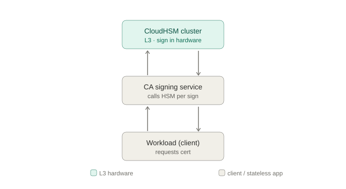
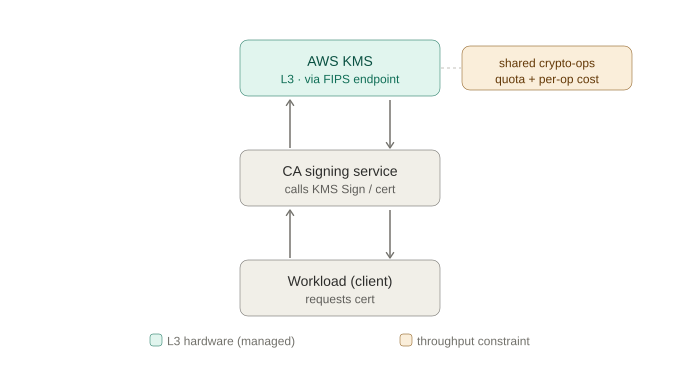
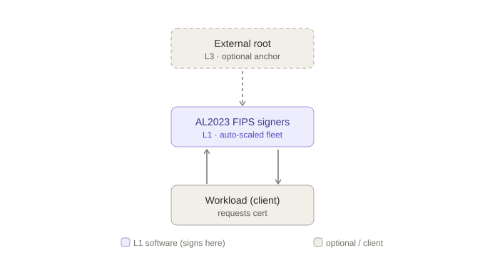
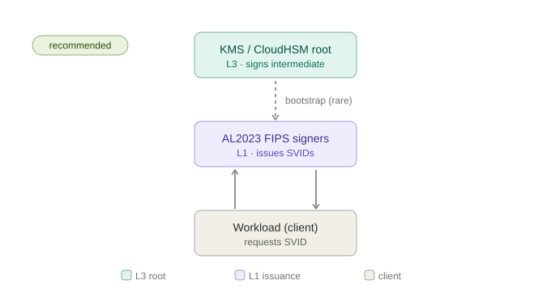
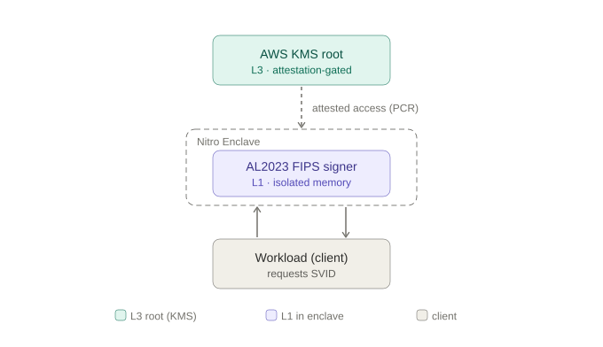

# ADR-00XX: Certificate / Workload-Identity Signing Architecture for 1,000–5,000 TPS under a FIPS 140-3 Level 1 Floor

- **Status:** Proposed
- **Date:** 2026-06-04
- **Deciders:** Cyber Architecture / PKI / Platform Engineering
- **Environment:** Regulated enterprise (PCI-DSS Level 1), ~1.2M agents, workload-identity issuance (SPIFFE/SPIRE / Athenz)
- **Supersedes / Related:** (link upstream PKI hierarchy ADR, OpAMP/mTLS ADR)

> Verify every figure flagged 🟡 against current AWS pricing/quota pages and the CMVP Active Validation List before this ADR is ratified. Module validation status in particular is time-sensitive.

---

## 1. Context and Problem Statement

We need a signing tier for certificate / workload-identity issuance that can sustain **1,000, 2,000, and 5,000 signing operations per second** (sizing tiers, not a single fixed target). The **minimum acceptable cryptographic assurance is FIPS 140-3 Level 1**; higher is acceptable where justified by cost and operational fit.

The decision must state, for each option: the FIPS 140-3 module-validation **level actually satisfied**, the **NIST algorithm-level** compliance, how it **scales to each TPS tier**, and the **cost shape**.

Two non-obvious facts drive the whole analysis:

1. **FIPS 140-3 Level 1 is a software-correctness floor only.** It carries **no physical-security and no operator-authentication requirement**. It validates that approved algorithms are implemented correctly in an approved module — it says nothing about protecting a long-lived key from a host compromise. For a CA *root/issuing* key, a PCI assessor will generally expect stronger key custody than L1 software, even though L1 satisfies the literal module-validation checkbox. **"L1 at least" is satisfied by all options below; key-custody for the root is a separate control we call out explicitly.**

2. **The FIPS level depends on *where the signing operation executes*, not on which products are in the diagram.** A design that "uses KMS" is only L3 *for the operations KMS actually performs*. If the high-volume signing happens in a software module, that path is L1 regardless of what anchors the root.

---

## 2. Decision Drivers

- Cryptographic assurance: FIPS 140-3 **Level 1 minimum**; hardware (L3) custody for the root strongly preferred.
- Throughput: must scale cleanly across 1k / 2k / 5k TPS with N−1 high availability.
- Cost shape: flat vs. per-operation; behavior under sustained vs. bursty duty cycle.
- Operational burden: managed service vs. self-run cluster vs. self-run fleet.
- Auditability: validated certificate **issued** (not merely "in process") at ratification time.
- Agility: ability to rotate algorithms (FIPS 186-5 / SP 800-131A) and adopt PQC later.

---

## 3. Key Facts (verified 2026-06-04)

| Fact | Value | Source status |
|---|---|---|
| CloudHSM instance type | Only `hsm2m.medium` (FIPS 140-3 L3); `hsm1.medium` end-of-support 2026-03-31, auto-migrated | ✅ AWS-published |
| CloudHSM signing throughput (per HSM, derived) | RSA-2048 ≈ 1,000/s; EC P-256 ≈ 1,500/s; EC P-384 ≈ 600–900/s 🟡 | ✅ RSA/P-256 published; P-384 estimate |
| CloudHSM cost | ≈ $1.60/HSM/hr ≈ $1,168/HSM/mo 🟡 | 🟡 US-East, verify region |
| KMS HSM validation | FIPS 140-3 **Level 3** | ✅ AWS-published |
| KMS crypto-ops request rate (ECC/RSA) | Default ≈ 300–500/s, **shared per account+region**, adjustable via Service Quotas | ✅ AWS-published |
| KMS Sign pricing 🟡 | RSA-2048 ops ≈ $0.03/10k; other asymmetric (ECC) ≈ $0.15/10k | 🟡 verify current |
| AL2023 FIPS 140-3 (Kernel Crypto API) | **Validated**, certificate #4808 | ✅ DEPLOYED |
| AL2023 FIPS 140-3 (OpenSSL, NSS, GnuTLS, Libgcrypt) | **Modules-In-Process (MIP)** — testing complete, awaiting CMVP certificate | ⚠️ ASPIRATIONAL (not yet certificated) |
| FIPS 140-2 modules | Move to **Historical** after 2026-09-21 — do not build new designs on them | ✅ AWS-published |

> ⚠️ **Material audit caveat:** Most TLS/X.509 signing paths use **OpenSSL**, whose AL2023 FIPS 140-3 certificate is **not yet issued (MIP)**. If signing is routed through the Kernel Crypto API module (#4808) the path is fully validated *today*; if through OpenSSL it is "in process." A strict PCI assessor may accept MIP under an "in-process" allowance or may require an issued certificate. **Confirm with the assessor before relying on the OpenSSL path.**

Software signing throughput, for context (single modern core, order-of-magnitude): ECDSA P-256 ≈ 20k–40k/s, ECDSA P-384 ≈ 3k–8k/s, RSA-2048 sign ≈ 1k–2k/s. **Throughput is never the constraint for software options — assurance and key custody are.**

---

## 4. Considered Options

### Option A — Scale a CloudHSM cluster (signing inside the HSM)

Keys are generated and never leave the `hsm2m.medium` HSM; every signature executes in hardware.

- **FIPS level satisfied:** **140-3 Level 3** (tamper-evident/responsive hardware, identity-based operator auth, physical security). Exceeds the floor.
- **NIST:** FIPS 186-5 signatures; SP 800-57 lifecycle; SP 800-131A key strengths — all satisfied with approved curves/RSA.
- **Scaling (incl. N−1 HA):**

  | TPS | RSA-2048 HSMs | EC P-256 HSMs |
  |---|---|---|
  | 1,000 | 2 | 2 |
  | 2,000 | 3 | 2–3 |
  | 5,000 | 6 | 4–5 |

- **Cost shape:** **Flat**, duty-cycle independent. ~$2.3k/mo (2 HSM) → ~$7k/mo (6 HSM). 🟡
- **Pros:** Highest assurance; single-tenant; key never in general-purpose memory; cost is bounded and predictable at high sustained TPS.
- **Cons:** You operate the cluster (quorum, backups, AZ spread); per-HSM throughput is fixed (especially RSA); 3,333 asymmetric-key-per-cluster cap; scaling is in coarse ~1k-TPS (RSA) increments.

### Option B — KMS direct asymmetric signing

Application calls KMS `Sign` for each certificate; key resides in KMS HSMs.

- **FIPS level satisfied:** **140-3 Level 3** (KMS HSMs) **— only if** the SDK targets the **FIPS endpoints** (`kms-fips.<region>.amazonaws.com`). Default endpoints are not the validated boundary.
- **NIST:** same algorithm-level compliance as A.
- **Scaling:** **Gated by the shared crypto-ops quota** (~300–500/s default, per account *and* region, shared across all KMS users in the account). Reaching 5,000 TPS requires a ~10× Service Quotas increase that (a) is not guaranteed and (b) contends with every other KMS consumer in the account.
- **Cost shape:** **Per-operation — scales linearly with volume.** At *sustained* TPS 🟡:

  | TPS | RSA-2048 ($0.03/10k) | ECC ($0.15/10k) |
  |---|---|---|
  | 1,000 | ~$7.8k/mo | ~$38.9k/mo |
  | 5,000 | ~$38.9k/mo | ~$194k/mo |

- **Pros:** Fully managed, zero crypto infra, instant HA/DR; **cheapest for low or bursty duty cycles** (you pay only for calls made).
- **Cons:** Shared quota is the hard ceiling and a noisy-neighbor risk within the account; **dramatically the most expensive option at sustained high TPS**; per-call latency added to issuance.
- **Variant B′ — CloudHSM-backed KMS custom key store:** KMS API ergonomics + single-tenant CloudHSM key residency. Throughput is bounded by *both* KMS quota and the backing cluster; this is a key-residency/control play, **not** a throughput win.

### Option C — Software signing on AL2023 FIPS mode, auto-scaled

Intermediate/issuing key held in memory on AL2023 instances in FIPS mode; signing in the AL2023 module; scale via Auto Scaling Group.

- **FIPS level satisfied:** **140-3 Level 1** — **fully validated today only if signing uses the Kernel Crypto API module (#4808)**; **MIP (not yet certificated) if via OpenSSL/NSS/GnuTLS/Libgcrypt.** ⚠️
- **NIST:** FIPS 186-5 / SP 800-57 / SP 800-131A satisfied with approved algorithms in FIPS mode.
- **Scaling:** Trivial. A few cores cover 5,000 TPS for ECDSA; the ASG over-provisions for HA cheaply. Throughput is not the constraint.
- **Cost shape:** **Near-flat and cheap** — a handful of EC2 instances (low hundreds $/mo).
- **Pros:** Cheapest; effortless throughput; cloud-native autoscaling; algorithm-agile.
- **Cons:** **The issuing key lives in general-purpose memory protected only at L1** — a host/hypervisor compromise or memory disclosure exposes it. Unacceptable as a *standalone root*; acceptable only for **short-TTL issuance with the root anchored elsewhere** (→ Option D). OpenSSL MIP caveat applies.

### Option D — Tiered: L3 root (KMS or CloudHSM) → L1 software intermediate (auto-scaled) → leaf SVIDs  ⟵ **RECOMMENDED**

The root/issuing CA key sits in **KMS or CloudHSM (L3)** and signs a **short-lived intermediate** infrequently. The high-volume leaf/SVID issuance runs on the **AL2023 FIPS (L1) auto-scaled fleet**. This is the SPIFFE/SPIRE-native pattern (`aws_kms` upstream authority + in-memory leaf keys).

- **FIPS level satisfied:** **L3 for the root anchor; L1 for high-volume issuance.** Meets the "L1 at least" floor **and** gives a hardware-rooted chain.
- **NIST:** same algorithm-level compliance; SP 800-57 lifecycle is *better* served (clear root/intermediate/leaf separation, short leaf TTLs).
- **Scaling:** Software tier scales to 5,000 TPS+ trivially; KMS/CloudHSM is touched only for rare intermediate renewals, so **neither the KMS quota nor CloudHSM per-HSM throughput is ever on the hot path**.
- **Cost shape:** ~Flat EC2 + negligible KMS (a few `Sign` calls per intermediate rotation). **Best $/TPS at every tier.**
- **Pros:** Decouples assurance (root) from throughput (leaf); cheapest at scale; quota/throughput pressure eliminated; aligns with existing SPIRE/Athenz direction.
- **Cons:** Issuance-tier assurance is L1 (mitigated by short TTLs — a compromised leaf key is valid only minutes and never persisted); more moving parts than a single managed service; OpenSSL MIP caveat applies to the leaf module.

### Option E — Nitro Enclaves + AL2023 FIPS (hardened L1)

Run the signing component (e.g., the intermediate signer of Option D) **inside Nitro Enclaves**: isolated memory, no persistent storage, no interactive access, with **KMS access gated on enclave attestation** (`kms:RecipientAttestation:PCR0`).

- **FIPS level satisfied:** **140-3 Level 1** crypto **plus** hardware memory isolation + attestation — materially stronger key-in-memory protection than plain L1, **without** L3 cost. (Note: the enclave image needs its **own** FIPS module inside; host FIPS mode does not extend into the enclave.)
- **NIST:** same as C/D.
- **Scaling:** As software (high), minus modest enclave overhead.
- **Cost shape:** ~Flat EC2 (enclave-capable instances) + negligible KMS.
- **Pros:** Closes the "intermediate key exposed in host memory" gap of C/D; only the attested image can use the root key.
- **Cons:** Highest operational complexity of the L1 options; enclave build/attestation pipeline required; in-enclave FIPS module must be validated/MIP-tracked separately.

---

## 5. Comparison Summary

| | A: CloudHSM | B: KMS direct | C: AL2023 SW | D: Tiered (rec.) | E: Enclave+FIPS |
|---|---|---|---|---|---|
| FIPS 140-3 level | **L3** | **L3** (FIPS endpoint) | **L1** ⚠️MIP | **L3 root / L1 leaf** | **L1 + HW isolation** |
| Meets L1 floor | ✅ exceeds | ✅ exceeds | ✅ | ✅ | ✅ |
| Hardware root custody | ✅ | ✅ | ❌ (needs anchor) | ✅ | ✅ (via KMS) |
| 5,000 TPS feasible | ✅ (6 HSM) | ⚠️ needs 10× quota | ✅ easily | ✅ easily | ✅ easily |
| Cost @ sustained 5k TPS | ~$7k/mo flat 🟡 | $39k–194k/mo 🟡 | ~hundreds $/mo | ~hundreds $/mo + tiny KMS | ~hundreds $/mo |
| Cost @ low/bursty | poor (still flat) | **best** | best | best | best |
| Ops burden | high | lowest | medium | medium-high | highest |
| Audit-ready today | ✅ | ✅ | ⚠️ OpenSSL MIP | ✅ root / ⚠️ leaf | ⚠️ MIP |

---

## 6. Decision Outcome

**Recommended: Option D (Tiered, L3 root → L1 auto-scaled issuance), with Option E as the hardening upgrade for the intermediate signer where host-memory exposure of the intermediate key is in scope.**

Rationale: D is the only option that satisfies the FIPS 140-3 L1 floor, provides a **hardware-rooted (L3) trust anchor**, scales to 5,000 TPS **without** hitting the KMS shared quota or CloudHSM per-HSM ceiling, and has the **best cost at every TPS tier**. It also matches the existing SPIFFE/SPIRE / Athenz direction.

**Fallbacks by constraint:**
- If a regulator/assessor requires the **issuing** key (not just the root) in **hardware** → use **Option A** at the issuance tier, sized per the table (accept higher cost and per-HSM scaling).
- If duty cycle is genuinely **low/bursty** and simplicity dominates → **Option B** is cheapest and zero-ops, provided the quota covers peak.

---

## 7. Consequences

- We must **anchor the root in KMS or CloudHSM** and keep intermediate TTLs short (bounds blast radius of the L1 issuance tier).
- We must **resolve the OpenSSL-MIP question with the PCI assessor** before ratification, or route signing through the validated Kernel Crypto API module (#4808).
- We must **not** build any path on FIPS 140-2 modules (Historical after 2026-09-21).
- KMS calls (root/intermediate) must use **FIPS endpoints** and **instance-role credentials**; high-TPS leaf signing must **not** call KMS per-cert.
- Add CloudWatch alarms on KMS crypto-ops quota utilization even in Option D (intermediate-renewal spikes).
- Revisit when **ML-DSA on CloudHSM** exits preview and AL2023's **OpenSSL FIPS 140-3 certificate is issued** — both change the assurance/agility calculus.

---

## 8. Open Items / To Verify Before Ratification

1. 🟡 Confirm `hsm2m.medium` hourly rate and KMS per-op pricing for our region.
2. 🟡 Confirm current KMS ECC/RSA crypto-ops quota in our account/region and feasibility of a 10× increase (Option B only).
3. ⚠️ Assessor ruling on AL2023 OpenSSL **MIP** status vs. issued certificate.
4. Confirm CMVP certificate numbers on the Active Validation List for every module cited.
5. Decide signing algorithm (RSA-2048 vs. EC P-256 vs. P-384) — drives the Option A sizing table and cost.
