# DLP Composer — Architecture Diagrams

Working drafts for the proposal document. Mermaid format for iteration.

---

## Diagram 1: The Canonical Hierarchy (Tab 1 + Tab 6.1)

The single most important visual. Shows the four-layer separation and what each layer owns.

```mermaid
graph TB
    subgraph POLICY["<b>Policy</b> — WHERE to deploy"]
        P_DESC["Assigns RuleSets to Realms/Agents<br/>Deployment mode: active, staged, disabled<br/>Policy-wide exceptions (privileged users, boilerplate stripping)"]
    end

    subgraph RULESET["<b>RuleSet</b> — HOW to organize"]
        RS_DESC["Ordered group of Rules<br/>Evaluation: first_match or all_matches<br/>Compliance purpose (PCI, HIPAA, IP protection)"]
    end

    subgraph RULE["<b>Rule</b> — WHEN to act"]
        R_SCOPE["<b>Scope:</b> WHO (users/groups) | WHERE (channels/direction)<br/>FROM (senders/apps/geo) | TO (recipients/URLs/devices)<br/>WHAT (operations) | WHEN (schedule)"]
        R_MODE["<b>Mode:</b> Analysis | Monitor | Detect | Enforce"]
        R_LABELS["<b>Label Scope:</b> IncludeLabels | ExcludeLabels"]
        R_ACTIONS["<b>Actions:</b> block | quarantine | encrypt | notify | log"]
    end

    subgraph DETECTION["<b>Detection</b> — WHAT to find"]
        D_GROUPS["<b>Groups</b> (AND/OR between groups)"]
        D_COND["<b>Conditions:</b> pattern | dictionary | proximity<br/>file_type | edm | idm | ml_classifier | classification_label"]
        D_FP["<b>FP Reduction:</b> validators | ignore expressions<br/>proximity context | negative scoring | breadth"]
        D_COMPLIANCE["<b>Compliance:</b> regulation_refs | jurisdiction<br/>data_subject_type | legal_basis"]
    end

    POLICY --> RULESET
    RULESET --> RULE
    RULE --> DETECTION

    style DETECTION fill:#e8f5e9,stroke:#2e7d32,stroke-width:2px
    style RULE fill:#e3f2fd,stroke:#1565c0,stroke-width:2px
    style RULESET fill:#fff3e0,stroke:#e65100,stroke-width:2px
    style POLICY fill:#fce4ec,stroke:#c62828,stroke-width:2px
```

**Key message:** Each layer does ONE thing. Detection is reusable across Rules. Rules bind detection to context. RuleSets order Rules. Policy assigns to infrastructure. No vendor cleanly separates these.

---

## Diagram 2: Scope Boundaries — System Context (Tab 3)

DLP Composer's position in the ecosystem. What we consume vs produce.

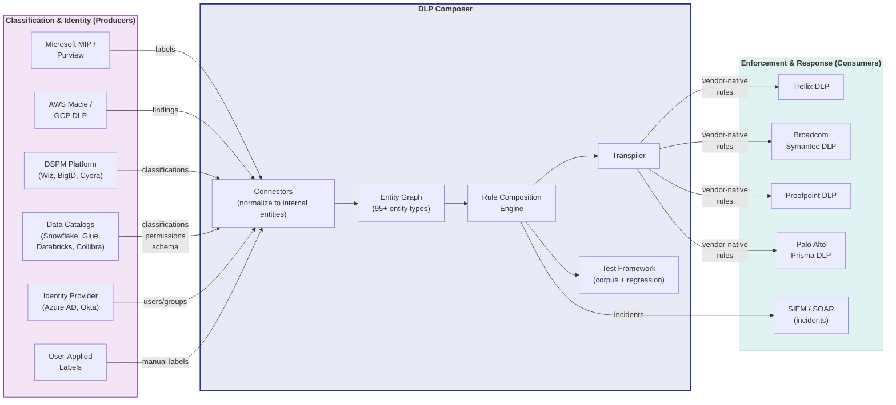

**Key message:** DLP Composer sits between classification systems (producers) and enforcement systems (consumers). We normalize inbound, transpile outbound. Changing any producer or consumer = update connector, not rules.

---

## Diagram 3: Seven-Layer FP Elimination Stack (Tab 6.4)

The funnel showing how each layer reduces false positives.

```mermaid
graph TB
    INPUT["<b>Content Arrives</b><br/>Email with: 'Order ref: 4532015112830366'<br/>+ boilerplate disclaimer"]

    subgraph POLICY_LEVEL["POLICY LEVEL — before detection"]
        L7["<b>Layer 7: Boilerplate Stripping</b><br/>IgnoredTextList strips 'This email is confidential...'<br/>Prevents keyword FP on every email<br/><i>Eliminates: universal noise across all detections</i>"]
    end

    subgraph DETECTION_LEVEL["DETECTION LEVEL — content analysis"]
        L1["<b>Layer 1: Pattern Match</b><br/>Regex fires on 4532015112830366<br/>Score: +10<br/><i>Without other layers, this is an alert (FP)</i>"]
        L2["<b>Layer 2: Validator</b><br/>Luhn check — does the number pass?<br/>Eliminates 30-60% of numeric FPs<br/><i>Mathematical proof of structural validity</i>"]
        L3["<b>Layer 3: Ignore Expressions</b><br/>'order ref: + digits' matches suppression pattern<br/>Match subtracted — score drops to 0<br/><i>Surgical removal of known FP patterns</i>"]
        L4["<b>Layer 4: Proximity Context</b><br/>No financial keywords within 300 chars<br/>'tracking page for delivery' ≠ financial context<br/><i>No context = no detection</i>"]
        L5["<b>Layer 5: Negative Scoring</b><br/>'tracking' (-8) + 'delivery' (-8) = -16<br/>Aggregate: +10 - 16 = -6 (below threshold)<br/><i>Counter-indicators actively suppress score</i>"]
    end

    subgraph SCOPE_LEVEL["SCOPE LEVEL — after detection"]
        L6["<b>Layer 6: Rule Scope Exclusions</b><br/>Sender in excluded list (automated logistics)<br/>Match is real but context is legitimate<br/><i>Detection correct, enforcement not needed</i>"]
    end

    RESULT["<b>Result: No Alert</b><br/>6 independent layers caught this FP<br/>In vendor tools: only Layer 1 exists → false alert"]

    INPUT --> L7
    L7 --> L1
    L1 --> L2
    L2 --> L3
    L3 -->|"CAUGHT HERE"| RESULT
    L3 -.->|"if not caught"| L4
    L4 -.->|"if not caught"| L5
    L5 -.->|"if not caught"| L6
    L6 -.-> RESULT

    style POLICY_LEVEL fill:#fff3e0,stroke:#e65100,stroke-width:2px
    style DETECTION_LEVEL fill:#e8f5e9,stroke:#2e7d32,stroke-width:2px
    style SCOPE_LEVEL fill:#e3f2fd,stroke:#1565c0,stroke-width:2px
    style RESULT fill:#c8e6c9,stroke:#2e7d32,stroke-width:3px
    style INPUT fill:#ffebee,stroke:#c62828,stroke-width:2px
```

**Key message:** Six independent chances to catch a false positive. Each layer operates at a different architectural level. In vendor tools, you get Layer 1 (regex) and maybe a manual exception list. Everything else is missing.

---

## Diagram 4: Label Flow Architecture (Tab 6.5)

How external labels flow into rule composition.

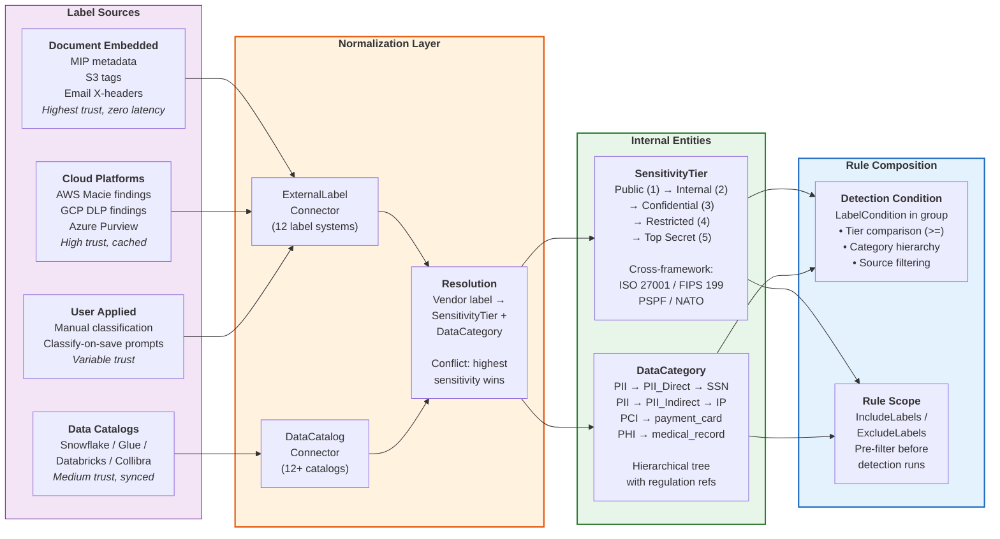

**Key message:** Labels from ANY source normalize to the same two internal entities (SensitivityTier + DataCategory). Rules reference internal entities, never vendor strings. Change your DSPM vendor = update connector, not rules.

---

## Diagram 5: Transpiler Pipeline (Tab 6.10 + Tab 8)

How canonical rules fan out to vendor-specific formats.

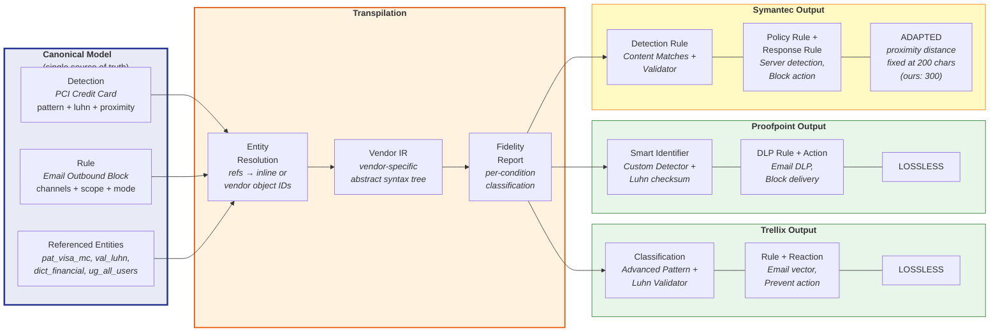

**Key message:** Write once, transpile to any vendor. Each vendor output includes a fidelity report — the author knows BEFORE committing what translates losslessly vs what degrades. Symantec example shows "ADAPTED" — functionally equivalent but with a structural difference (proximity window).

---

## Diagram 6: FP Optimization — Workflow 1: User-Driven Feedback Loop (Tab 10.1)

Per-incident flow: analyst marks FP → system recommends suppression labels → analyst approves → immediate enforcement.

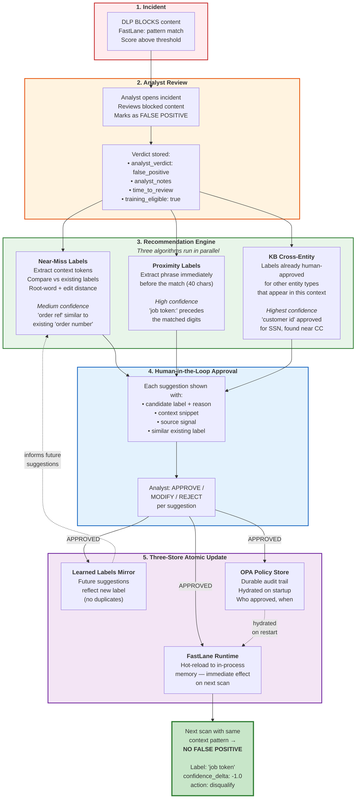

**Key message:** Every analyst FP verdict becomes a learning opportunity. The system doesn't just log the verdict — it analyzes the content, recommends specific suppression labels, and applies them immediately on approval. No rule editing, no redeployment, no restart.

---

## Diagram 7: FP Optimization — Workflow 2: ML Clustering Pipeline (Tab 10.2)

Batch flow: accumulated FP data → clustering → systemic suppression discovery → human review.

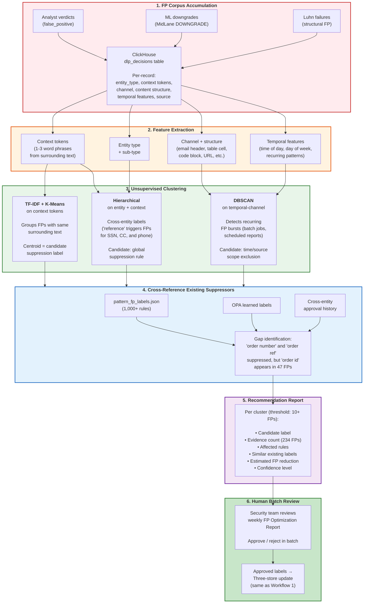

**Key message:** Individual analysts see one FP at a time. Clustering sees patterns across thousands — "badge number" appears in 234 SSN FPs but isn't in the suppression list. No individual analyst would notice this. The system surfaces it with evidence for batch approval.

---

## Diagram 8: FP Maturity Staircase — Three Levels (Tab 10.3)

Progressive automation from fully manual to autonomous with guardrails.

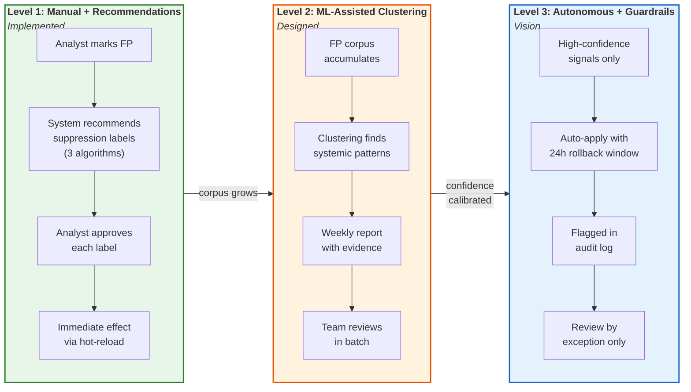

**Key message:** Start conservative (every label needs human approval), graduate to batch review (weekly clustering reports), then selective autonomy (only highest-confidence patterns auto-apply). Each level builds on the data and trust from the previous one.

---

## Diagram 9: FP Feedback Data Architecture (Tab 10.4)

End-to-end data flow from production scan to ML retraining.

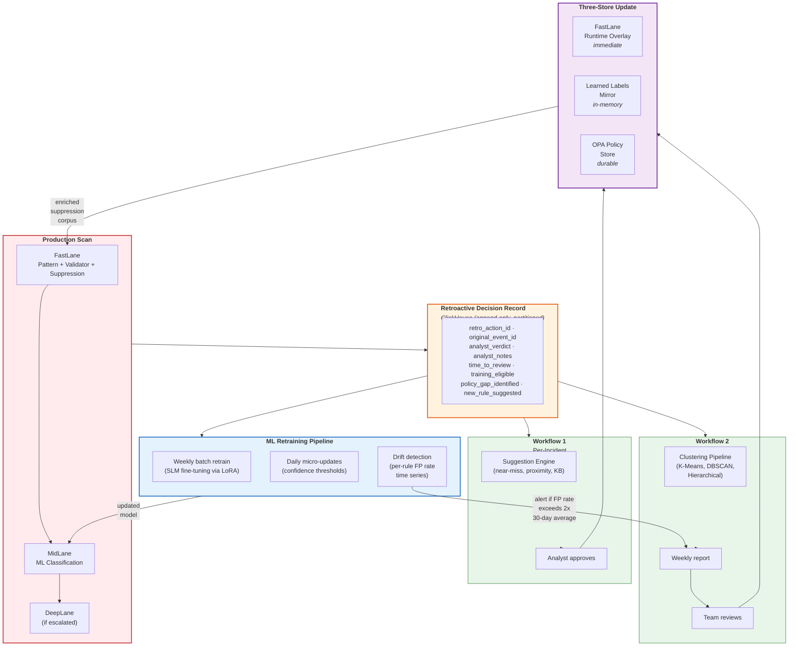

**Key message:** Two feedback loops — one fast (per-incident, minutes), one deep (batch clustering, weekly). Both feed the same three-store update. Drift detection monitors for rules getting worse over time. The system gets measurably better with every analyst interaction.

---

## Diagram 10: Label Integration — Connector Sync Architecture (Tab 11.2)

How external label sources connect to DLP Composer through five read methods.

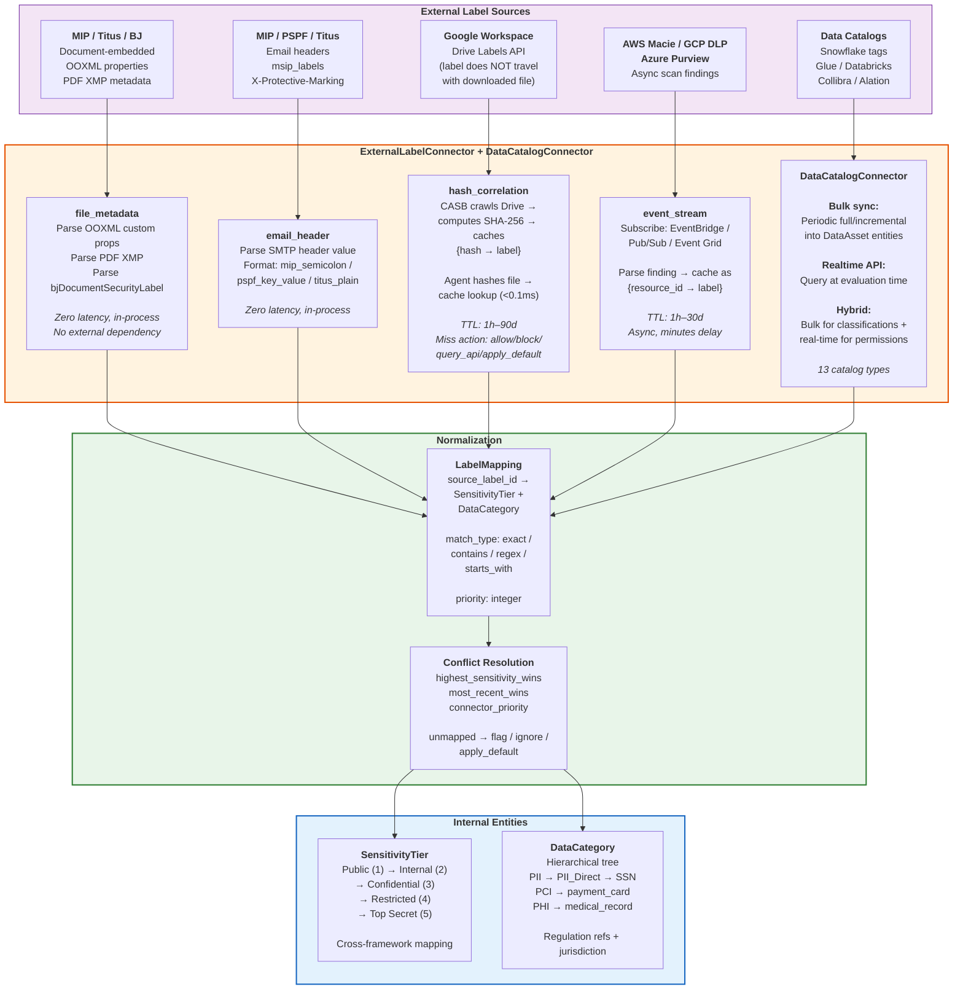

**Key message:** Five read methods exist because label storage is fundamentally different across sources. Document-embedded labels have zero latency. Cloud labels need caching. Google labels need hash correlation because they don't travel with downloaded files. Each connector encapsulates the complexity — the rule engine only sees normalized SensitivityTier + DataCategory.

---

## Diagram 11: Label Runtime Enforcement Pipeline (Tab 11.5)

Six-stage pipeline from content interception to enforcement action, showing where labels are evaluated.

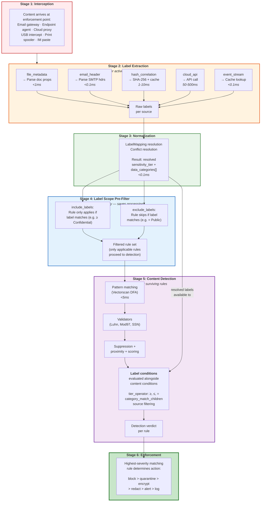

**Key message:** Labels are evaluated twice — once at Stage 4 (scope pre-filter, eliminates rules early) and once at Stage 5 (as detection conditions alongside content matching). This two-pass design means expensive content detection only runs on documents that pass the label filter. A "Confidential+ PCI" rule skips all Public documents at Stage 4 — no regex, no ML, no processing.

---

## Diagram 12: Label Channel Availability Matrix (Tab 11.5)

Which label read methods are available at each enforcement channel.

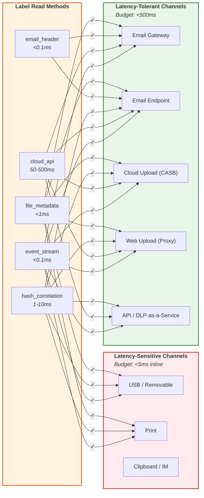

**Key message:** Latency-sensitive channels (USB, print) can only use zero-latency methods (file_metadata, hash_correlation, event_stream cache). Cloud API calls are reserved for channels where 50-500ms latency is acceptable (email, cloud upload). When a label source is unavailable at a channel, the rule degrades gracefully to content-only enforcement rather than failing.

---

## Diagram 13: Label Operational Scenario — Google Drive to USB (Tab 11.7)

End-to-end walkthrough: Google Workspace label → hash correlation → USB enforcement.

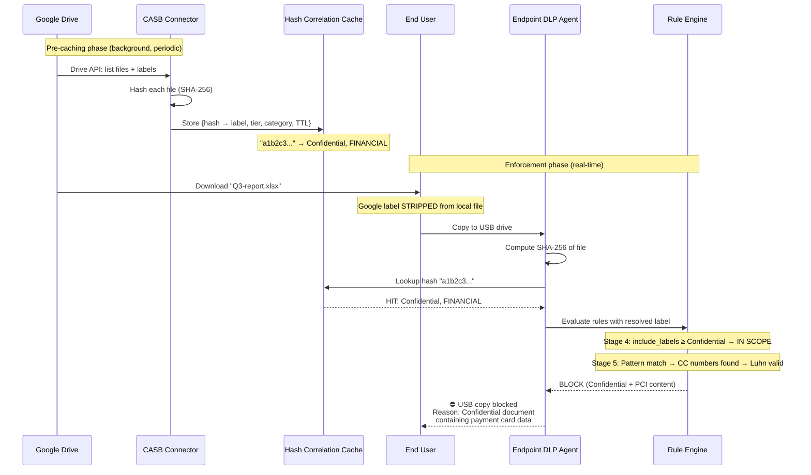

**Key message:** The Google Workspace label doesn't travel with the downloaded file — but hash correlation preserves it. The user sees a seamless enforcement experience: the DLP agent knows the file is "Confidential - Financial" even though the label is no longer embedded in the local copy.

---

## Diagram 14: Label Normalization — Multi-Source Conflict Resolution (Tab 11.3)

What happens when the same document has labels from multiple sources that disagree.

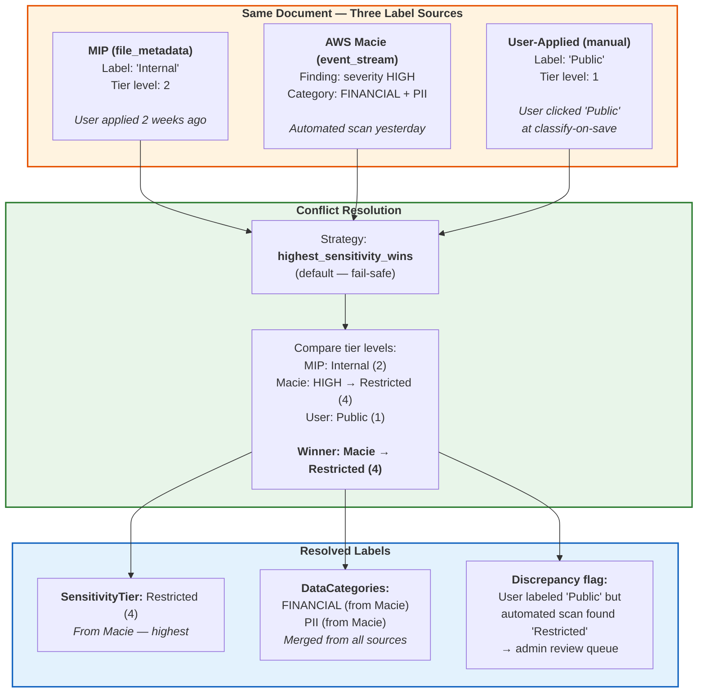

**Key message:** highest_sensitivity_wins is the fail-safe default — over-protect, never under-protect. When a user labels something "Public" but Macie finds PII and financial data, the system treats it as Restricted AND flags the discrepancy for admin review. The user's label isn't silently trusted when automated classification disagrees.

---

## Additional Diagrams (to add in second pass)

| # | Diagram | Tab | Format |
|---|---------|-----|--------|
| 15 | Entity Composition Graph (SSN example) | 6.2 | Entity-relationship diagram showing Pattern, Validator, Dictionary, Regulation entities with reference arrows |
| 16 | Authoring Experience Flow | 6.6 | 5-step loop: edit → preview → AI recommend → accept → validate |
| 17 | Testing Pipeline (dual engine) | 6.7 | Two swim lanes: browser (WASM) vs CI (Vectorscan) |
| 18 | Production Feedback Loop | 6.7 | Circular: deploy → match → classify → corpus grows → improve → redeploy |
| 19 | A/M/E/D Mode Progression | 6.9 | State machine: A → M → D → E with time-in-mode |
| 20 | Challenge Causal Chain | 2 | Monolithic → fragmentation → no reuse → no testing → FPs → program failure |
| 21 | Benefits Traceability | 7 | Sankey: challenges → capabilities → metrics |
| 22 | Self-Learning Staircase | 4.3 | L0 → L4 ascending with human involvement decreasing |
| 23 | Vendor Complexity Quadrant | 8.6 | API maturity vs integration effort, vendors plotted |

---

*These diagrams are in Mermaid format for iteration. Final versions for Google Docs will be exported as images.*
